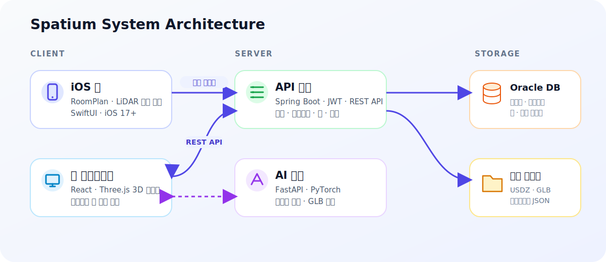
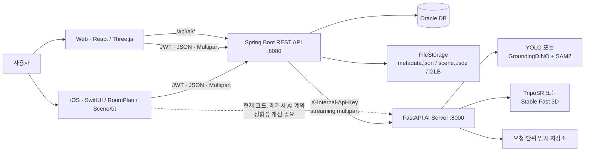
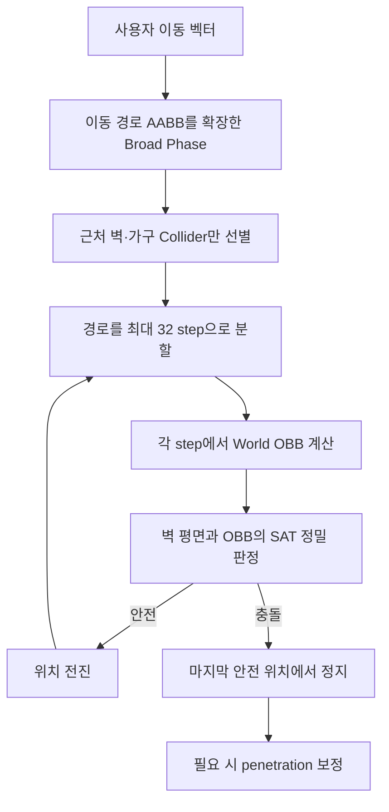
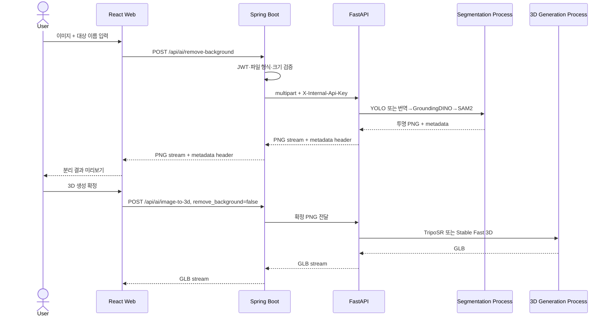
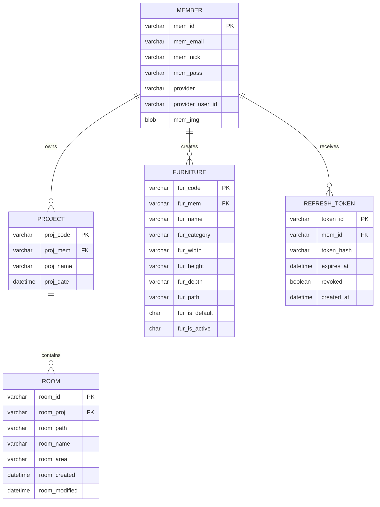
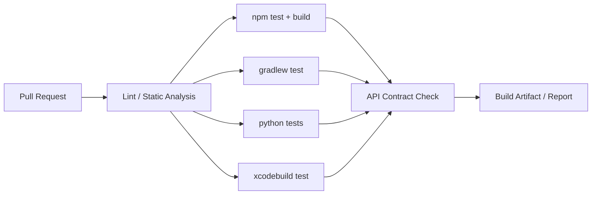

# Spatium — Full-Stack Project Portfolio

> **iPhone LiDAR 공간 스캔부터 3D 인테리어 편집, 사진 기반 3D 가구 생성까지 연결한 멀티플랫폼 공간 편집 서비스**

<p align="center">
  
</p>

> 이 문서는 2026년 7월 17일 저장소의 실제 코드를 기준으로 작성한 포트폴리오용 기술 문서입니다.  
> 저장소만으로 확인할 수 없는 개인 담당 범위와 회고 수치는 `작성 필요`로 표시했습니다.

---

## 1. 프로젝트 요약

| 항목 | 내용 |
| --- | --- |
| 프로젝트명 | **Spatium** |
| 한 줄 소개 | 현실 공간을 LiDAR로 스캔하고, 웹·iOS에서 가구를 배치하거나 사진 속 사물을 3D 모델로 생성하는 공간 편집 플랫폼 |
| 개발 기간 | **2026.06.25 ~ 2026.07.16** — 현재 Git 이력 기준, 실제 기획 기간은 확인 필요 |
| 프로젝트 형태 | 팀 프로젝트, 모노레포 기반 4개 애플리케이션 |
| 팀 규모 | Git 작성자 계정 통합 기준 **약 4명** — 최종 확인 필요 |
| 플랫폼 | Web, iOS, REST API Server, GPU AI Inference Server |
| 핵심 기술 | React 19, Three.js, Spring Boot 4, Oracle, FastAPI, PyTorch, SwiftUI, RoomPlan, SceneKit |
| 주요 산출물 | 웹 서비스, iOS 앱, 백엔드 API, Image-to-3D 파이프라인, 3D 편집 엔진, 기술 문서 및 테스트 |
| 저장소 | [github.com/dongha0312/Spatium](https://github.com/dongha0312/Spatium) |
| 개인 담당 | **작성 필요:** 본인이 실제로 설계·구현·개선한 범위와 기여도를 기재 |

### 1.1 Elevator Pitch

Spatium은 사용자가 iPhone의 LiDAR 센서로 자신의 방을 스캔한 뒤, 실측 기반 3D 공간에서 가구의 크기와 동선을 미리 검증할 수 있게 하는 서비스입니다. 원하는 가구 에셋이 없으면 사진 한 장에서 대상 사물을 분리하고 GLB 모델로 생성해 개인 가구 카탈로그에 추가할 수 있습니다. **공간 획득 → 자산 생성 → 3D 편집 → 저장·복원**이라는 서로 다른 기술 영역을 하나의 사용자 흐름으로 통합했습니다.

### 1.2 핵심 성과

- iOS RoomPlan 스캔, Spring Boot API, React/Three.js 에디터, FastAPI GPU 추론 서버를 하나의 제품 흐름으로 구성했습니다.
- 단순 3D 뷰어를 넘어 OBB·SAT·Sweep 기반 충돌 제어, 문·창문 두께 보정, 벽 투명화, 치수 표시, undo/redo를 지원하는 편집기를 구현했습니다.
- YOLO 또는 GroundingDINO + SAM2로 객체를 분리하고 TripoSR 또는 Stable Fast 3D로 GLB를 생성하는 교체 가능한 AI 파이프라인을 설계했습니다.
- JWT access/refresh 분리, refresh token rotation, 재사용 탐지, HttpOnly 쿠키, 로그인 제한, 내부 AI API Key 등 다계층 보안을 적용했습니다.
- 약 **45.6K 라인 / 252개 코드 파일** 규모의 웹·백엔드·AI·iOS 코드를 하나의 저장소에서 관리합니다. 이 수치는 각 애플리케이션의 주요 `src`·`app` 디렉터리를 대상으로 한 단순 집계이며 일부 테스트 파일을 포함합니다.

---

## 2. 문제 정의와 기획 배경

### 2.1 해결하려는 문제

기존 인테리어 시뮬레이션은 실제 방의 치수와 구조를 직접 입력해야 하거나, 정해진 가구 에셋 안에서만 편집해야 하는 경우가 많습니다. 이 때문에 다음 문제가 발생합니다.

1. 평면 이미지나 임의 크기의 가상 방만으로는 가구가 실제로 들어가는지 판단하기 어렵습니다.
2. 방의 벽·문·창문 위치를 사용자가 직접 측정하고 모델링하는 과정의 진입 장벽이 높습니다.
3. 원하는 가구의 3D 에셋을 검색하거나 직접 제작하려면 모델링 지식과 비용이 필요합니다.
4. 스캔, 모델 생성, 공간 편집, 결과 저장이 서로 다른 도구로 분리되어 작업 맥락이 끊깁니다.

### 2.2 해결 전략

| 문제 | Spatium의 접근 |
| --- | --- |
| 공간 입력의 번거로움 | RoomPlan과 LiDAR로 벽·문·창문·치수를 자동 수집 |
| 실제 배치 가능성 판단 | 미터 단위 좌표계와 충돌 제약을 적용한 3D 편집 |
| 제한된 가구 에셋 | 사진 → 객체 분리 → GLB 생성 파이프라인 제공 |
| 여러 도구 간 단절 | 프로젝트와 방을 중심으로 스캔·편집·자산을 통합 |
| 작업 유실 위험 | 재생 가능한 메타데이터와 iOS 임시 저장·복구 제공 |

### 2.3 목표 사용자

- 이사 또는 가구 구매 전 실제 공간 배치를 검토하려는 일반 사용자
- 자신의 방을 빠르게 3D로 기록하고 여러 배치안을 비교하려는 사용자
- 3D 모델링 경험 없이 보유 가구를 가상 공간에 배치하려는 사용자
- 현장 공간을 스캔해 상담·제안 자료로 활용하려는 인테리어 실무자

### 2.4 프로젝트 목표와 성공 기준

| 목표 | 제품 수준의 성공 기준 |
| --- | --- |
| 정확한 공간 재현 | RoomPlan 결과와 실제 치수를 미터 단위로 보존하고 동일 씬으로 복원 |
| 직관적인 편집 | 배치·이동·회전·크기·교체·삭제와 undo/redo 제공 |
| 현실적인 제약 | 가구가 벽을 통과하지 않고 문·창문 및 주변 가구와 자연스럽게 상호작용 |
| 사용자 자산 확장 | 이미지에서 원하는 사물을 분리해 GLB로 생성하고 카탈로그에 저장 |
| 작업 연속성 | 저장한 방을 다시 열었을 때 동일한 배치와 속성을 재현 |
| 멀티플랫폼 일관성 | 웹과 iOS가 동일한 프로젝트·방·가구 API 계약을 사용 |

> **포트폴리오 보강용 정량 지표 — 작성 필요**  
> 실제 사용자 테스트 인원, 평균 스캔/생성 시간, 생성 성공률, API 응답 시간, 충돌 오류 감소율, 테스트 통과율을 측정했다면 이 표에 추가하는 것이 좋습니다. 측정하지 않은 수치는 만들지 않습니다.

---

## 3. 핵심 사용자 여정

### 3.1 방 스캔과 편집

1. 사용자가 iOS 앱에서 로그인하거나 게스트로 진입합니다.
2. 새 프로젝트를 만들고 RoomPlan으로 방을 스캔합니다.
3. 스캔 결과를 검토한 뒤 USDZ와 메타데이터를 백엔드에 멀티파트로 업로드합니다.
4. 웹 또는 iOS에서 프로젝트의 방을 엽니다.
5. 기본 가구 또는 사용자 생성 가구를 배치하고 위치·회전·크기·색상을 편집합니다.
6. 충돌 검사와 벽 표시 보조를 활용해 현실적인 배치를 구성합니다.
7. 편집 결과를 저장하고 이후 같은 상태로 복원합니다.

### 3.2 사진으로 나만의 가구 생성

1. 사용자가 가구 사진을 업로드하고 찾을 대상 이름을 입력합니다.
2. 한국어 입력은 필요 시 영어로 번역됩니다.
3. YOLO 또는 GroundingDINO가 대상을 찾고 SAM2가 정밀 마스크를 생성합니다.
4. 배경이 제거된 PNG를 사용자에게 미리 보여 줍니다.
5. 확인된 PNG를 TripoSR 또는 Stable Fast 3D에 전달해 GLB를 생성합니다.
6. 사용자가 방향·회전·크기를 보정하고 개인 가구로 저장합니다.
7. 생성된 가구를 기존 카탈로그 자산과 동일하게 방에 배치합니다.

### 3.3 데모 화면

| 공간 준비 | 방 불러오기 |
| --- | --- |
|  |  |
| **가구 배치·편집** | **결과 저장** |
|  |  |

---

## 4. 전체 시스템 아키텍처





### 4.1 컴포넌트 책임

| 컴포넌트 | 핵심 책임 | 주요 입출력 |
| --- | --- | --- |
| `spatium-ios` | LiDAR 스캔, 모바일 편집, 프로젝트·가구 로컬 캐시, 인증 | RoomPlan JSON, USDZ, GLB, REST |
| `spatium-frontend` | 회원 UI, 프로젝트 관리, Three.js 3D 편집, Image-to-3D 위저드 | REST, Blob URL, replayable metadata |
| `spatium-backend` | 인증·인가, CRUD, 소유권 검증, 파일 저장, AI 게이트웨이 | JSON envelope, multipart, binary stream |
| `spatium-img-to-3d` | 이미지 검증, 분할, 배경 제거, 3D 생성, 결과 정리 | PNG/JPEG/WebP → PNG 또는 GLB |
| Oracle DB | 회원·프로젝트·방·가구·refresh token 메타데이터 | 관계형 데이터 |
| FileStorage | 대용량 씬·메타데이터·사용자 모델 저장 | `metadata.json`, `scene.usdz`, `.glb` |

### 4.2 아키텍처 선택 이유

- **모듈러 모노리스 + 독립 AI 서비스:** 비즈니스 API는 Spring Boot에 모으고 GPU 런타임은 Python으로 분리해 배포와 장애 경계를 명확히 했습니다.
- **DB와 바이너리 분리:** 검색·권한·관계 정보는 Oracle에, USDZ·GLB·JSON은 파일 저장소에 두어 대용량 BLOB이 일반 조회 경로를 압박하지 않게 했습니다.
- **AI 게이트웨이:** 웹 클라이언트가 내부 AI Key를 알지 않도록 Spring Boot가 인증·검증·에러 변환·스트리밍을 담당합니다.
- **플랫폼별 3D 엔진:** 웹은 Three.js, iOS는 SceneKit을 사용하되 미터 단위 좌표와 저장 데이터 규약을 공유합니다.
- **교체 가능한 Provider:** segmentation과 generation을 추상화해 모델 품질·속도·GPU 환경에 따라 조합할 수 있습니다.

---

## 5. 기술 스택과 선택 근거

### 5.1 Web Frontend

| 기술 | 버전 | 사용 목적 |
| --- | ---: | --- |
| React | 19.2.7 | 페이지와 단계형 UI, 편집기 상태 구성 |
| React Router | 6.30.4 | 인증·회원·에디터·매뉴얼 라우팅 |
| Three.js | 0.185.0 | GLB/USD 계열 씬 렌더링, Raycasting, OBB 충돌, 카메라 제어 |
| Axios | 1.18.1 | API 인스턴스, 토큰 재발급, Blob 응답 처리 |
| Create React App | react-scripts 5.0.1 | 개발 서버와 빌드 환경 |

**선택 근거:** UI 상태와 DOM 접근성이 중요한 영역은 React로, 고성능 3D 렌더링과 공간 연산은 Three.js로 분리했습니다. 3D 엔진 상태는 React의 잦은 렌더링과 분리하기 위해 `ref`와 기능별 scene module을 활용합니다.

### 5.2 Backend

| 기술 | 버전 | 사용 목적 |
| --- | ---: | --- |
| Java | 17 | 백엔드 언어 및 HttpClient 스트리밍 |
| Spring Boot | 4.0.7 | REST API와 애플리케이션 구성 |
| Spring Security | Boot 관리 버전 | JWT 필터 체인과 엔드포인트 인가 |
| Spring Data JPA | Boot 관리 버전 | Oracle 데이터 접근 |
| JJWT | 0.12.6 | access/refresh JWT 생성·검증 |
| Oracle JDBC | 21.1.0.0 | Oracle DB 연결 |
| Gradle | Wrapper | 의존성과 빌드 관리 |

**선택 근거:** 인증·트랜잭션·검증이 집중되는 비즈니스 API에는 Spring 생태계를 사용하고, 대용량 AI 결과에는 Java 17 `HttpClient`와 `StreamingResponseBody`를 사용해 전체 파일을 서버 메모리에 복제하지 않도록 했습니다.

### 5.3 AI / Image-to-3D

| 기술 | 버전 또는 구성 | 사용 목적 |
| --- | --- | --- |
| Python | 3.11+ | AI 서비스 런타임 |
| FastAPI | 0.115+ | multipart 추론 API와 의존성 주입 |
| PyTorch / torchvision | 2.11.0 / 0.26.0, CUDA 12.8 index | GPU 추론 |
| YOLO | Ultralytics 8.3+ | 클래스 기반 객체 탐지·분할 |
| GroundingDINO + SAM2 | 격리 환경 | 자연어 탐지와 정밀 세그멘테이션 |
| TripoSR | 격리 환경 | 단일 이미지 기반 빠른 3D 생성 |
| Stable Fast 3D | 격리 환경 | 텍스처·메시 품질 선택지 |
| Trimesh / xatlas | 4.0.5 / 0.0.9 | GLB 처리와 UV 관련 후처리 |
| uv | lockfile 기반 | 재현 가능한 Python 환경 관리 |

**선택 근거:** 무거운 모델을 별도 프로세스와 가상환경으로 격리해 상충하는 의존성과 GPU 메모리 점유를 제어했습니다. FastAPI 프로세스는 요청 조율과 파일 생명주기에 집중합니다.

### 5.4 iOS

| 기술 | 버전 | 사용 목적 |
| --- | ---: | --- |
| Swift / SwiftUI | Swift 5.0 | 앱 UI와 상태 관리 |
| RoomPlan | iOS 17+ | LiDAR 기반 방 구조 캡처 |
| SceneKit | iOS SDK | 모바일 3D 편집과 카메라 제어 |
| GLTFKit2 | 0.5.15 | GLB/GLTF 로딩 |
| AuthenticationServices / CryptoKit | iOS SDK | Google·Apple OAuth 흐름과 암호 기능 |
| Swift Concurrency | async/await, actor, TaskGroup | 네트워크·토큰 재발급·병렬 작업 제어 |

**선택 근거:** RoomPlan과 긴밀하게 연동되는 네이티브 스캔 경험을 위해 iOS 앱을 별도 구현했습니다. 외부 의존성을 GLTFKit2 하나로 제한하고 Apple 프레임워크를 우선 사용했습니다.

### 5.5 Data / Collaboration

- Oracle Database, JPA, SQL migration scripts
- JSON, USDZ, GLB, PNG/JPEG/WebP
- Git/GitHub, 기능 브랜치와 Pull Request merge 이력
- Markdown 기반 아키텍처·3D 로직·발표 문서

---

## 6. 주요 기능 명세

### 6.1 인증과 회원

- 로컬 회원가입·로그인·로그아웃·회원 탈퇴
- Google·Apple ID Token 검증 기반 소셜 로그인·가입
- 내 정보와 프로필 이미지 조회·수정·삭제
- access token 만료 시 refresh token으로 자동 재발급
- 웹 refresh token은 HttpOnly 쿠키로 전달하고 access token과 용도를 분리
- iOS는 동시 401 상황에서 `actor` 기반 재발급 조정기로 rotation 경쟁을 방지

### 6.2 프로젝트와 방

- 사용자별 프로젝트 생성·목록·상세·이름 변경·삭제
- 프로젝트 하위의 여러 방 생성·조회·수정·삭제
- iOS RoomPlan 결과의 JSON + USDZ 멀티파트 업로드
- 방 면적·생성일·수정일·scene 데이터 관리
- 모든 변경 API에서 현재 사용자와 자원 소유자를 검증

### 6.3 3D 공간 편집

- 스캔 씬 또는 replayable metadata에서 방 복원
- 기본·사용자 가구의 배치, 선택, 이동, 회전, 높이, 크기, 교체, 삭제
- 문·창문 참조 객체의 교체와 벽 두께 자동 fitting
- 문·창문 삭제 시 개구부 유지 또는 벽 infill 표현
- 벽·바닥 색상 변경, 방 치수·면적 라벨
- 1인칭·3인칭·상단 시점과 카메라 기준 벽 투명화
- 책장 선반 자동 탐지와 피규어·소품 배치
- 최대 30단계 웹 편집 이력 및 iOS gesture coalescing 기반 undo/redo
- iOS 편집 draft의 atomic 저장, 복구, 실패 노출과 재시도

### 6.4 가구 카탈로그

- 기본 가구와 사용자 생성 가구 통합 조회
- 카테고리, 한글·영문명, 가로·세로·높이, GLB 경로 관리
- 사용자 가구 multipart 업로드와 soft delete
- 모델이 없거나 로딩에 실패할 때 fallback geometry 사용
- 레거시 cm 데이터를 m 단위로 마이그레이션하는 클라이언트 방어 로직

### 6.5 Image-to-3D

- PNG/JPEG/WebP 파일의 실제 바이트와 픽셀 수 검증
- YOLO 클래스 기반 또는 자연어 기반 객체 선택
- 한국어 질의 번역 → GroundingDINO 탐지 → SAM2 마스크 생성
- 투명 PNG 미리보기 후 확정된 결과만 3D 생성
- TripoSR와 Stable Fast 3D provider 선택
- 생성된 GLB 방향·회전·크기 보정과 사용자 카탈로그 저장
- 요청 취소, 장시간 timeout, provider별 오류 메시지 처리

### 6.6 오프라인·접근성·반응형 UX

- iOS 프로젝트 목록 디스크 캐시와 로그인 세션별 격리
- 낙관적 UI 갱신 후 실패 시 rollback
- VoiceOver 사용자를 위한 책장 선반 목록 선택과 소품 배치 컨트롤
- Dynamic Type과 iPhone 가로모드 전용 compact-height 레이아웃
- 키보드가 열린 상태에서도 주요 CTA가 가려지지 않는 safe-area 구성
- 햅틱 성공·실패 피드백과 통합 오류 알림

---

## 7. 핵심 기술 ① — 실측 기반 3D 편집 엔진

### 7.1 렌더링과 편집 상태 분리

React 상태만으로 Three.js 객체를 직접 관리하면 드래그 중 잦은 재렌더링과 객체 수명주기 문제가 생깁니다. Spatium은 다음과 같이 책임을 나눕니다.

- React: 페이지 상태, 툴바, 선택 정보, API 호출, 저장 상태
- Three.js scene module: 모델 생성, 좌표 변환, 충돌, 카메라, 라벨, dispose
- `useRoomSceneEditor`: UI 이벤트와 scene action을 연결하는 orchestration hook
- metadata serializer: 런타임 객체를 저장 가능한 JSON으로 변환

웹 에디터의 scene 로직은 collision, wall collider, loader, transform, measurement, camera, visibility 단위로 모듈화되어 있습니다. iOS도 ViewModel을 history, draft, furniture, decor 기능별 extension과 controller로 나누어 거대한 화면의 책임을 분리했습니다.

### 7.2 좌표와 단위 규약

- RoomPlan과 가구 치수의 기준 단위는 **meter**입니다.
- 로컬 bounding box를 모델의 world matrix로 변환해 충돌용 world OBB를 계산합니다.
- 회전된 객체의 치수와 footprint를 축 정렬 박스만으로 판단하지 않습니다.
- GLB의 축·원점·스케일 차이는 정규화와 orientation baking 단계에서 보정합니다.

### 7.3 OBB + SAT + Sweep 충돌 제어

단순 AABB는 가구가 회전할수록 실제보다 큰 충돌 영역을 만들어 정상적인 배치를 막습니다. Spatium은 객체의 방향을 보존하는 OBB와 분리축 정리(SAT)를 사용합니다.



성능을 위해 먼저 이동 경로의 AABB로 broad phase를 수행하고, 가까운 collider에만 정밀 판정을 적용합니다. 스텝 루프에서는 OBB 객체를 반복 생성하지 않고 재사용합니다. 이 방식은 빠른 드래그에서 물체가 얇은 벽을 건너뛰는 tunneling 문제를 줄입니다.

### 7.4 불규칙한 스캔 벽 처리

LiDAR 결과의 벽은 항상 이상적인 직육면체가 아닙니다. 전체 mesh의 bounding box를 벽로 사용하면 방 안쪽까지 과도한 충돌 영역이 생길 수 있습니다. 따라서 벽의 실제 geometry와 면 방향을 기준으로 collider를 구성하고, 객체의 footprint를 벽 평면에 투영해 **방 안쪽 경계 침범 여부**를 판단합니다.

### 7.5 문·창문과 카메라 가시성

- 문·창문 GLB는 스캔된 opening의 위치·회전은 유지하고 모델만 교체합니다.
- 에셋 두께를 벽 collider의 법선과 span에 맞춰 자동 fitting합니다.
- 카메라와 벽 법선의 dot product로 시야를 가리는 벽만 투명하게 만듭니다.
- 1인칭 모드에서는 가구 추가를 제한하는 등 시점별 허용 동작을 분리합니다.

### 7.6 재생 가능한 저장 형식

편집 결과를 렌더링 객체 자체로 저장하지 않고 위치·회전·크기·카테고리·asset path·부모-자식 관계·방 정보를 JSON으로 직렬화합니다. 원본 RoomPlan metadata에 `_spatiumRoom` 정보를 포함시켜 다음 진입 시 편집 씬을 다시 생성할 수 있습니다.

웹 undo/redo는 큰 방 JSON을 매 이력마다 복제하지 않고 reference cache에 공유해 메모리 사용을 줄입니다. iOS는 저장 완료본과 draft fingerprint를 비교해 실제로 복구할 변경이 있을 때만 복구 UI를 표시합니다.

---

## 8. 핵심 기술 ② — Image-to-3D 파이프라인

### 8.1 처리 흐름



### 8.2 두 단계 UX를 선택한 이유

객체 분리와 3D 생성을 한 요청으로 처리하면 잘못 선택된 대상에도 비싼 GPU 추론을 수행하게 됩니다. 먼저 저비용 분리 결과를 확인시킨 뒤 GLB 생성을 실행함으로써 다음 효과를 얻었습니다.

- 사용자가 잘못된 마스크를 조기에 수정할 수 있습니다.
- 이미 투명 PNG를 확보했으므로 생성 요청에서 `remove_background=false`로 중복 연산을 제거합니다.
- segmentation provider와 generation provider를 독립적으로 바꿀 수 있습니다.

### 8.3 GPU 자원과 프로세스 관리

- 무거운 모델을 별도 venv와 subprocess에서 실행해 Python 의존성 충돌을 격리합니다.
- 기본 GPU 동시 실행 수를 1로 제한하는 semaphore로 OOM 위험을 낮춥니다.
- 대기 중 취소된 요청은 slot을 소비하지 않도록 처리합니다.
- timeout 또는 cancellation 시 자식 프로세스를 종료하고 회수합니다.
- 단일 GPU 환경에서는 Uvicorn worker 1개를 전제로 합니다. process-local semaphore는 여러 worker 사이를 조정하지 못하기 때문입니다.

### 8.4 파일 생명주기와 스트리밍

- 업로드 파일은 요청 범위 임시 경로에 저장하고 처리 직후 제거합니다.
- PNG·GLB는 `FileResponse`로 스트리밍하고 응답 완료 후 background cleanup으로 삭제합니다.
- 메타데이터는 작은 JSON을 base64url로 인코딩해 `X-Spatium-AI-Metadata` 헤더로 전달합니다.
- Spring Boot 게이트웨이는 upstream `InputStream`을 `StreamingResponseBody`로 연결해 중간 서버 메모리 복사를 줄입니다.
- 관리 경로 밖 파일 삭제, path traversal, 잘못된 확장자, 구조적으로 손상된 GLB를 거부합니다.

### 8.5 AI 품질의 현실적 한계

- 단일 이미지 기반 모델은 보이지 않는 뒷면을 추정하므로 입력 각도와 배경에 민감합니다.
- 한 장면에 여러 객체가 겹치거나 대상이 잘리면 segmentation과 geometry 품질이 낮아집니다.
- 제품 중심·단색 배경·충분한 여백이 있는 사진이 유리합니다.
- 결과를 실측 가구로 사용하려면 사용자가 실제 치수를 입력하거나 별도 scale calibration이 필요합니다.

---

## 9. 핵심 기술 ③ — 인증·보안 설계

### 9.1 인증 흐름

| 항목 | 구현 |
| --- | --- |
| 비밀번호 | BCrypt 단방향 해시 |
| access token | HS256 JWT, `type=access`, 만료 1시간 |
| refresh token | `type=refresh`, 만료 14일 |
| 웹 저장 | refresh token을 HttpOnly cookie로 전달 |
| 서버 저장 | refresh token 원문이 아닌 SHA-256 hash 저장 |
| 재발급 | 사용한 refresh token을 즉시 폐기하고 새 토큰 발급 |
| 재사용 탐지 | 이미 폐기된 refresh token 사용 시 회원의 유효 토큰 전체 폐기 |
| API 인증 | stateless SecurityFilterChain + Bearer filter |
| 소셜 인증 | Google·Apple JWKS, issuer, audience 기반 ID Token 검증 |

access와 refresh의 claim type을 검사해 두 토큰을 서로의 용도로 사용할 수 없게 했습니다. iOS에서는 여러 API가 동시에 401을 받았을 때 `AuthRefreshCoordinator` actor가 재발급을 하나로 직렬화하고 나머지 요청은 같은 결과를 기다립니다.

### 9.2 공격 표면 완화

- 로그인: 10분 실패 창에서 5회 실패 시 5분 잠금
- 회원가입: IP 기준 10분당 10회 제한
- 이미지 업로드: 선언된 MIME만 신뢰하지 않고 실제 이미지 decode와 pixel count 검사
- 파일 경로: 정규화 후 관리 root 내부인지 확인
- AI 서버: 브라우저에 노출하지 않는 `X-Internal-Api-Key`와 constant-time 비교
- AI 응답: content type allowlist, metadata 최대 8KB, 오류 body 최대 64KB
- JWT secret: HS256을 위해 최소 32 byte 강제
- 공통 401/오류 계약: 클라이언트가 인증 만료와 일반 오류를 안정적으로 구분

### 9.3 현재 운영 보안 과제

- iOS 배포 주소가 IP 기반 HTTP이며 ATS 전역 허용을 사용합니다. 도메인·TLS 적용 후 예외를 제거해야 합니다.
- 로그인·가입 제한기는 단일 JVM 메모리 기반이므로 다중 인스턴스에서는 Redis 등 공유 저장소가 필요합니다.
- AI Key rotation, secret manager, 감사 로그, 악성 파일 검사와 사용자별 quota가 추가로 필요합니다.
- iOS `ImgTo3DService`는 현재 FastAPI의 내부 Key + binary stream 계약이 아니라 과거 JSON `download_url` 계약을 기대합니다. 운영에서는 모바일도 Spring AI 게이트웨이를 사용하도록 통일하는 것이 안전합니다.

---

## 10. 데이터베이스 설계

### 10.1 논리 ERD



### 10.2 테이블 역할

| 테이블 | 역할 | 주요 설계 포인트 |
| --- | --- | --- |
| `Member` | 로컬·소셜 회원 | 소셜 회원은 password nullable, 이미지·개인정보 로그 제외 |
| `Project` | 여러 방을 묶는 사용자 작업 단위 | `proj_mem`으로 소유자 연결 |
| `Room` | 스캔·편집 단위 | 대용량 파일 대신 storage prefix를 `room_path`로 보관 |
| `Furniture` | 기본·사용자 가구 카탈로그 | default/user 구분, active flag로 soft delete |
| `refresh_token` | 서버측 세션 통제 | 원문 대신 hash, 만료·폐기 상태 저장 |

### 10.3 관계 처리의 특징과 개선점

현재 Entity는 JPA `@ManyToOne` 객체 관계 대신 문자열 식별자를 저장하고 service/repository에서 소유권을 직접 검증합니다. 직렬화 순환과 불필요한 lazy loading을 피하고 SQL을 단순하게 유지할 수 있지만, 다음 개선이 필요합니다.

- DB foreign key와 unique index가 migration에 확실히 반영됐는지 검증
- email과 `(provider, provider_user_id)` 중복 제약 명시
- 목록 조회용 index: `Project.proj_mem`, `Room.room_proj`, `Furniture.fur_mem`, `RefreshToken.mem_id/token_hash`
- 가구 치수 VARCHAR 컬럼을 숫자형으로 마이그레이션하고 단위 규약을 DB 수준에서 고정
- DDL 변경을 개별 SQL 파일에서 Flyway/Liquibase 버전 마이그레이션으로 전환

---

## 11. API 설계

### 11.1 공통 규칙

- Base URL: Spring Boot `:8080`, FastAPI `:8000`
- 일반 응답: `{ statusCode, message, data }` envelope
- 오류 응답: `{ statusCode, code, message, errors }`
- 인증: `Authorization: Bearer <accessToken>`
- 웹 refresh token: HttpOnly cookie
- 파일: `multipart/form-data`
- AI 결과: PNG/GLB binary stream + metadata response header

### 11.2 Auth / User API

| Method | Endpoint | 설명 | 인증 |
| --- | --- | --- | --- |
| POST | `/api/users` | 로컬 회원가입 | 공개 |
| POST | `/api/auth/sessions` | 로컬 로그인과 세션 발급 | 공개 |
| POST | `/api/auth/social-sessions` | 소셜 로그인 | 공개 |
| POST | `/api/auth/social-users` | 소셜 회원가입 | 공개 |
| POST | `/api/auth/token` | access/refresh 재발급 | refresh token |
| DELETE | `/api/auth/sessions/current` | 로그아웃 | 필요 |
| GET | `/api/users/me` | 내 정보 조회 | 필요 |
| PATCH | `/api/users/me` | 닉네임·생일·비밀번호 수정 | 필요 |
| PUT/DELETE | `/api/users/me/avatar` | 프로필 이미지 변경·삭제 | 필요 |
| DELETE | `/api/users/me` | 회원 탈퇴 | 필요 |

### 11.3 Project / Room API

| Method | Endpoint | 설명 |
| --- | --- | --- |
| GET/POST | `/api/projects` | 프로젝트 목록·생성 |
| GET/PATCH | `/api/projects/{projectId}` | 프로젝트 상세·이름 변경 |
| DELETE | `/api/projects` | 프로젝트 삭제 |
| GET/POST | `/api/projects/{projectId}/rooms` | 방 목록·스캔 업로드 |
| GET/PATCH | `/api/rooms/{roomId}` | 방 상세·이름 변경 |
| GET | `/api/rooms/{roomId}/scene` | metadata와 USDZ scene 조회 |
| POST | `/api/rooms/save` | 편집 metadata와 면적 저장 |
| DELETE | `/api/rooms` | 방과 연관 파일 삭제 |

### 11.4 Furniture / AI API

| Method | Endpoint | 설명 |
| --- | --- | --- |
| GET | `/api/furniture` | 기본 가구 목록 — 공개 |
| GET | `/api/furniture/user` | 현재 사용자의 가구 목록 |
| GET | `/api/furniture/{furCode}/model` | GLB 모델 스트리밍 |
| POST | `/api/furniture` | 사용자 가구와 metadata 업로드 |
| DELETE | `/api/furniture/{furCode}` | 사용자 가구 비활성화 |
| POST | `/api/ai/remove-background` | 인증된 사용자 이미지 분리 게이트웨이 |
| POST | `/api/ai/image-to-3d` | 인증된 사용자 GLB 생성 게이트웨이 |
| GET | `/health` | FastAPI 상태 확인 |
| GET | `/v1/providers` | 내부 generation provider 목록 |
| GET | `/v1/segmentation-providers` | 내부 segmentation provider 목록 |
| POST | `/v1/remove-background` | 내부 PNG 생성 API |
| POST | `/v1/image-to-3d` | 내부 GLB 생성 API |

---

## 12. 파일 저장과 데이터 정합성

### 12.1 저장 구조

```text
storage-root/
└── users/{memId}/
    └── projects/{projectId}/
        └── rooms/{roomId}/
            ├── metadata.json
            └── scene.usdz
```

DB에는 방의 storage prefix만 저장하고 실제 파일은 `FileStorage` 추상화를 통해 관리합니다. 이 구조는 향후 로컬 디스크를 S3 호환 object storage로 교체할 때 service layer의 변경을 줄여 줍니다.

### 12.2 DB와 파일 시스템의 원자성 보완

관계형 DB transaction과 파일 시스템 쓰기는 하나의 원자적 transaction이 아닙니다. 이를 완화하기 위해 다음 시점을 구분합니다.

- 업로드 중 DB 저장 실패: 이미 쓴 파일을 즉시 정리
- transaction rollback: 등록한 cleanup callback으로 파일 제거
- 삭제 성공 후 commit: DB 삭제가 확정된 다음 파일 정리
- AI 응답 완료: background task로 일시 산출물 삭제

이 접근은 분산 transaction 없이도 orphan file과 DB dangling reference 가능성을 줄입니다. 다만 프로세스 강제 종료 시 cleanup이 누락될 수 있으므로 운영 환경에서는 주기적 reconciliation job이 필요합니다.

---

## 13. 상태 관리와 클라이언트 설계

### 13.1 Web

- `axiosInstance`: access token 첨부, 인증 오류 처리, 공통 API 설정
- `springApi/*`: 회원·프로젝트·방·가구 API를 domain별 함수로 분리
- `pages/roomSceneEditor`: UI, hook, scene module을 계층화
- `pages/imgTo3d`: 업로드 → 이름 → 분리 → 생성 → 보정 → 저장의 단계형 wizard
- Blob URL은 사용 후 revoke하고 scene 교체 시 geometry·material·texture를 dispose

### 13.2 iOS

- `Core/Networking`: 공통 envelope, JSON·multipart API, 오류 모델
- `Core/Services`: 인증·프로젝트·방·가구·Image-to-3D 서비스
- `Core/Models`: API와 에디터 domain model
- `Features`: Auth, Scan, Rooms, Editor, ImgTo3D, Settings
- `ProjectStore`, `CurrentUserStore`, `UserFurnitureStore`: 앱 전역 상태와 로컬 캐시

iOS 프로젝트 목록은 캐시를 먼저 보여 주고 서버 결과로 갱신합니다. 생성·수정·삭제는 낙관적으로 화면에 반영하되 실패하면 이전 상태로 rollback합니다. 서버 동기화가 성공하면 서버를 권위 상태로 간주합니다.

### 13.3 오프라인 전략의 한계

현재 outbox나 tombstone이 없어 오프라인 변경이 서버에 전달되기 전 앱이 종료되면 다음 refresh에서 서버 값으로 되돌아갈 수 있습니다. 게스트 프로젝트 역시 로그인 시 서버 목록이 캐시를 덮으면 유실될 가능성이 있습니다. 향후에는 mutation queue, idempotency key, conflict policy가 필요합니다.

---

## 14. 테스트와 품질 보증

### 14.1 테스트 현황

| 영역 | 프레임워크 | 저장소에서 확인한 테스트 수 | 주요 대상 |
| --- | --- | ---: | --- |
| Backend | JUnit / Spring Test | 10 | AI 인증, gateway, storage, 파일 검증, object key |
| AI | unittest / async test | 22 | API 계약, concurrency, image validation, subprocess, storage |
| iOS Unit | Swift Testing | 50+ | API 계약, editor history, draft, scan, GLB, cache, 접근성 로직 |
| iOS UI | XCUITest | 22+ | 가로모드, Dynamic Type, editor, keyboard, refresh, ImgTo3D |
| Web | Jest / Testing Library | 기본 scaffold 수준 | 앱 smoke test 중심 — 보강 필요 |

> 테스트 수는 `@Test`, `def test_`, `func test`를 기준으로 단순 집계한 값입니다. 실제 실행 결과와 line coverage 수치는 CI에서 별도 측정해야 합니다.

### 14.2 회귀 중심 테스트 전략

- 파일 확장자가 아니라 실제 decode 결과와 byte/pixel 제한 검증
- cancellation과 timeout 시 child process 종료·회수 검증
- 관리 경로 밖 삭제와 path traversal 거부 검증
- AI 내부 API Key가 없거나 틀릴 때 거부되는지 통합 테스트
- iOS 요청 body key와 공통 envelope를 테스트로 고정해 API schema drift 감지
- HEIC→PNG, GLB transform baking, cm→m migration과 같은 실제 자산 호환성 검증
- 편집 undo/redo, draft 실패·재시도, 캐시 쓰기 실패·재시도 검증
- Dynamic Type과 landscape에서 주요 조작이 화면 밖으로 사라지지 않는지 UI 테스트

### 14.3 권장 CI Pipeline



현재 저장소에서는 GitHub Actions workflow가 확인되지 않았습니다. PR 품질을 안정화하려면 web build, backend test, GPU가 필요 없는 AI contract test를 우선 CI에 올리고, iOS와 GPU smoke test는 macOS/self-hosted runner로 분리하는 것이 현실적입니다.

---

## 15. 성능·안정성 설계

### 15.1 적용한 최적화

- OBB 정밀 판정 전에 swept AABB broad phase로 후보 collider 축소
- 움직이지 않는 문·창문 world OBB와 활성 collider cache
- 3D 모델과 방 shell cache
- history에서 큰 room JSON을 reference로 공유
- scene 변경 시 전체 재생성보다 증분 transform 갱신
- geometry, material, texture, object URL 명시적 해제
- iOS 대용량 multipart를 임시 파일 + `URLSession.upload(fromFile:)`로 전송
- AI 결과를 FastAPI → Spring → Browser로 stream
- segmentation 확인 결과를 generation에 재사용해 중복 추론 제거

### 15.2 장애 대응

| 장애 | 처리 |
| --- | --- |
| access token 만료 | refresh 후 요청 1회 재시도 |
| 동시 다발 401 | iOS actor로 refresh 직렬화 |
| AI 미구성 | `AI_NOT_CONFIGURED` 503 |
| AI 연결 실패 | gateway에서 502로 표준화 |
| 잘못된 upstream content type | 응답 폐기 후 `AI_INVALID_RESPONSE` |
| GPU 요청 취소·timeout | child process 종료·회수 |
| 로컬 캐시 쓰기 실패 | 상태 노출, 메모리 유지, 최신 목록 재시도 |
| draft 저장 실패 | 사용자 알림과 재시도 제공 |
| DB rollback | 연계 파일 cleanup |

---

## 16. 문제 해결 경험

### 16.1 회전 가구의 부정확한 충돌과 벽 관통

**문제:** AABB 방식은 회전된 가구의 빈 공간까지 충돌로 계산하고, 빠른 드래그는 얇은 벽을 한 프레임에 통과했습니다.

**원인:** 축 정렬 bounding box는 객체 방향을 잃고, 시작점과 끝점만 검사하면 이동 경로 중간의 충돌을 놓칩니다.

**해결:** local bounding box를 world OBB로 변환하고 SAT로 정밀 교차를 판정했습니다. 이동 벡터는 최대 32 step으로 sweep하며 마지막 안전 위치에서 멈추게 했습니다. broad phase로 근처 벽만 선별하고 OBB 객체를 재사용해 연산량을 제어했습니다.

**배운 점:** 3D 인터랙션의 정확도와 성능은 하나의 알고리즘보다 broad phase, narrow phase, continuous movement를 계층화할 때 함께 확보할 수 있습니다.

### 16.2 스캔 벽의 bounding box가 실제 공간을 막는 문제

**문제:** 불규칙한 RoomPlan mesh를 전체 box로 단순화하면 방 내부까지 충돌 영역이 확장됐습니다.

**해결:** 벽 geometry의 실제 면, span, normal을 기준으로 collider를 생성하고 가구 footprint를 벽 평면에 투영했습니다. 단순 OBB 겹침이 아니라 방 안쪽 경계 침범을 기준으로 판단했습니다.

**배운 점:** 센서 데이터는 이상적인 CAD 데이터가 아니므로, 원본 데이터의 오차와 topology를 전제로 한 보정 계층이 필요합니다.

### 16.3 GPU 모델 간 메모리·의존성 충돌

**문제:** 번역, detection, segmentation, 3D generation 모델을 한 프로세스에 함께 올리면 패키지 버전 충돌과 GPU OOM 위험이 커졌습니다.

**해결:** 모델별 별도 venv와 subprocess를 두고 segmentation 프로세스가 종료된 뒤 generation을 실행했습니다. GPU semaphore, timeout, cancellation cleanup을 추가했습니다.

**배운 점:** AI 서비스의 안정성은 모델 정확도뿐 아니라 프로세스 수명주기와 자원 스케줄링 설계에 크게 좌우됩니다.

### 16.4 대용량 AI 결과의 서버 메모리 사용

**문제:** PNG·GLB를 byte array로 모두 읽어 중계하면 FastAPI, Spring, 브라우저 사이에서 같은 파일이 여러 번 복제될 수 있습니다.

**해결:** FastAPI `FileResponse`, Java `InputStream`, Spring `StreamingResponseBody`, 브라우저 Blob으로 스트리밍 경로를 구성했습니다. 작은 메타데이터만 제한된 response header로 전달했습니다.

**배운 점:** 대용량 응답 API는 DTO 설계만이 아니라 end-to-end backpressure와 자원 close 시점까지 설계해야 합니다.

### 16.5 refresh token 재발급 경쟁과 탈취 대응

**문제:** 여러 API가 동시에 401을 받으면 같은 refresh token을 중복 사용해 rotation이 꼬이거나, 탈취된 토큰의 재사용을 놓칠 수 있습니다.

**해결:** 서버에서 refresh 원문 대신 hash와 revoked 상태를 저장하고 1회 사용 후 폐기했습니다. 폐기 토큰 재사용 시 사용자의 토큰을 모두 무효화했습니다. iOS에서는 actor가 동시 refresh 요청을 하나로 합쳤습니다.

**배운 점:** stateless JWT도 안전한 로그아웃과 탈취 대응을 위해 최소한의 서버 상태와 클라이언트 동시성 제어가 필요합니다.

### 16.6 DB와 파일 저장소의 불일치

**문제:** 파일 저장 후 DB insert가 실패하거나 DB 삭제 후 파일 삭제가 실패하면 orphan 또는 dangling reference가 생길 수 있습니다.

**해결:** 즉시 cleanup, rollback cleanup, after-commit cleanup을 작업 종류에 맞게 분리했습니다. 저장 경로를 추상화해 정리 정책을 service 로직에서 일관되게 적용했습니다.

**배운 점:** 서로 다른 저장 매체를 사용할 때는 성공 경로보다 실패 순서와 보상 동작을 먼저 설계해야 합니다.

### 16.7 다중 방 스캔에서 가구가 수백 km 밖으로 날아가는 문제

**문제:** 206㎡ 다중 방 주택 스캔을 열면 초기 카메라 거리가 약 393,551m로 잡혀 방이 아예 보이지 않고, 일부 가구는 방에서 최대 192km 떨어진 곳이나 바닥 3m 아래에 렌더링됐습니다. 새로고침할 때마다 정확히 같은 좌표로 재현됐습니다.

**진단 과정:** "원본 데이터 문제인지 프론트 렌더링 로직 문제인지"를 계층별로 격리하며 좁혀 갔습니다.

1. **원본 데이터 검증** — iOS가 생성한 metadata JSON의 가구·문·창문 좌표가 모두 집 범위(21.6×19.8m) 안에 있고 바닥 높이(−1.148m)가 완벽히 일관됨을 확인했습니다. USDZ는 프론트와 동일한 three.js `USDLoader`로 Node에서 직접 파싱해 157개 mesh 전부 정상임을 확인했습니다. → **데이터와 로더는 무죄.**
2. **씬 감사 도구 제작** — 브라우저 콘솔에서 방 경계를 벗어난 모든 mesh를 벗어난 거리순으로 덤프하는 `spatiumSceneAudit()`를 에디터에 추가해, 이상 오브젝트가 전부 가구 GLB이고 **크기는 정상인데 위치만 이상함**을 확인했습니다.
3. **패턴 분석** — 모든 이상 좌표의 X:Z 비율이 정확히 2.076 = 0.9009/0.4339로, metadata 회전 행렬에 등장하는 **벽 법선 방향**과 일치함을 발견했습니다. 가구가 "벽 법선을 따라 밀려났다"는 결정적 단서였습니다.
4. **Node 재현 테스트** — 원본 USDZ + JSON으로 벽 콜라이더 생성부터 벽 제약 보정까지 실제 에디터 모듈을 그대로 실행하는 재현 스크립트를 만들어, 브라우저와 좌표 소수점까지 동일한 결과(최대 이동 213,523m)를 얻었습니다. → **원인 확정.**

**원인:** 로딩 직후 벽에 박힌 가구를 밀어내는 `pushObjectOutOfWalls()`가 매 반복 **모든 충돌 벽의 밀어내기 벡터를 합산**하는 구조였습니다. 방 1개 스캔에서는 벽의 `roomFacingNormal`(방 중심을 향하는 방향)이 항상 일관되지만, 다중 방 주택에서는 집 전체 bounding box 중심 기준 휴리스틱이 안쪽 벽마다 모순된 방향을 만들었고, 반복 10회 동안 밀어내기가 기하급수적으로 발산해 가구를 벽 법선 방향으로 수백 km까지 날려 보냈습니다. 이렇게 커진 씬 bounding box가 초기 카메라 프레이밍(거리·near plane)까지 연쇄적으로 망가뜨렸습니다.

**해결:**

- 벽 밀어내기의 총 이동 거리에 상한(2m)을 두고, 상한 초과 또는 10회 내 미수렴 시 보정을 포기하고 **저장된 원위치를 유지**하도록 수정했습니다. 벽에 살짝 겹친 가구가 방 밖으로 사라진 가구보다 낫다는 판단입니다.
- 재현 스크립트로 수정 효과를 수치 검증했습니다: 최대 이동 **213,523m → 0.69m** (남은 이동은 벽에 박힌 가구 1개를 빼내는 정상 보정).
- 재발 방어층을 함께 추가했습니다: 카메라 프레이밍을 raw bounding box 대신 메인 바닥 폴리곤 기준 박스로 계산, 저장 transform의 비정상 scale 리셋, mm/cm 단위로 들어온 치수의 자동 단위 추정, 방 경계 밖 오브젝트의 로드 시 복구·경고.

**후속 해결 — 안전장치가 만든 2차 증상:** 발산 시 원위치를 유지하게 하자, 이번에는 스캔 오차로 벽과 몇 cm씩 겹친 가구 36개(61개 중)가 겹친 채 렌더링되고, "충돌 없는 상태에서 출발"을 가정하는 이동 로직 때문에 움직일 수도 없게 됐습니다. 밀어내기의 방향 계산 자체를 고쳐서 해결했습니다 — 집 중심 휴리스틱 대신 **벽 로컬 축 기준 최소 이동(MTV)** 으로 "가구 중심이 이미 있는 쪽의 가까운 면"으로만 밀고, 수직 축은 제외해 가라앉기류 사고를 차단했습니다. 여러 벽(그리고 같은 벽을 나눠 덮는 1,196개 콜라이더)과 동시에 겹친 경우 벡터를 합산하면 같은 방향이 중복 누적되므로, **매 반복 가장 깊게 겹친 벽 하나만 해소하고 나머지는 다음 반복에서 재평가**하는 순차 수렴 방식으로 바꿨습니다. 그래도 해소되지 않는 가구(벽 안에 파묻힌 붙박이장 2개)는 플래그로 표시해 클릭 시 벽 제약을 임시 해제하고, 사용자가 꺼내면 정상 제약으로 복귀시켰습니다. 동일 재현 스크립트로 검증한 결과 겹친 가구 34/36개가 최대 0.342m의 수평 미세 이동만으로 해소됐고, 수직 이동은 0이었습니다.

**배운 점:** "데이터가 이상한가, 코드가 이상한가"는 각 계층(원본 파일 → 로더 → 저장소 → 런타임 로직)을 같은 조건으로 격리 실행해야 답할 수 있습니다. 특히 브라우저에서만 재현되는 3D 버그도 렌더링과 무관한 순수 연산 로직이라면 Node에서 실제 모듈로 재현 스크립트를 만들 수 있고, 이것이 추측성 수정 대신 **수치로 검증 가능한 수정**을 가능하게 했습니다. 또한 반복 수렴을 가정한 물리 보정 로직에는 발산 시나리오에 대한 상한과 안전한 포기 경로가 반드시 필요하며, 안전장치가 만든 2차 증상까지 같은 재현 하네스로 검증하면 수정-회귀 사이클을 빠르게 닫을 수 있습니다.

---

## 17. 협업과 개발 프로세스

### 17.1 저장소에서 확인되는 방식

- 기능별 브랜치에서 개발 후 Pull Request merge
- 2026.06.25부터 2026.07.16까지 354 commits
- 웹·백엔드·AI·iOS를 한 모노레포에서 계약과 문서로 연결
- 대규모 에디터를 hook, scene module, ViewModel extension, controller로 지속 리팩터링
- 회귀가 발생한 버그를 unit/UI test로 고정
- `README.md`, `PROJECT_OVERVIEW.md`, `3D_MODELING_LOGIC*.md`, 발표 문서를 함께 관리

### 17.2 권장 역할 표기 형식

아래 표는 실제 담당자 정보로 교체해야 합니다.

| 구분 | 담당자 | 담당 범위 | 대표 성과 |
| --- | --- | --- | --- |
| Web / 3D Editor | 작성 필요 | React, Three.js, 충돌·저장 | 작성 필요 |
| Backend | 작성 필요 | 인증, CRUD, 파일·AI gateway | 작성 필요 |
| AI | 작성 필요 | segmentation, generation, GPU 운영 | 작성 필요 |
| iOS | 작성 필요 | RoomPlan, SceneKit, 앱 UX | 작성 필요 |

### 17.3 개인 기여 작성 템플릿

```text
역할: [예: Full-Stack Developer / 3D Editor Lead]
기여도: [예: 팀 4명 중 개인 기여 30%]

- [문제] 어떤 사용자·기술 문제를 맡았는가
- [판단] 어떤 대안을 비교하고 왜 현재 설계를 선택했는가
- [구현] 본인이 만든 기능·모듈·API·테스트는 무엇인가
- [성과] 시간, 성공률, 오류율, 테스트 수 등 무엇이 개선됐는가
- [협업] API 계약, 코드 리뷰, 문서화로 다른 파트와 어떻게 연결했는가
```

단순히 “프론트엔드 담당”이라고 쓰기보다 **문제 → 판단 → 구현 → 검증 → 결과** 순서로 작성해야 면접에서 깊이를 설명하기 쉽습니다.

---

## 18. 한계와 개선 로드맵

### 18.1 현재 확인된 한계

| 우선순위 | 한계 | 영향 |
| --- | --- | --- |
| P0 | iOS AI client가 레거시 JSON/download URL 계약을 기대하지만 현재 FastAPI는 binary stream 반환 | iOS Image-to-3D E2E 정합성 문제 가능 |
| P0 | 배포 주소가 HTTP이고 iOS ATS 전역 허용 | 중간자 공격과 App Store 운영 리스크 |
| P1 | Web 3D 핵심 로직의 자동화 테스트 부족 | 충돌·저장 회귀 탐지 어려움 |
| P1 | CI workflow 미확인 | PR별 자동 품질 검증 부족 |
| P1 | 로컬 디스크 저장 | scale-out, 장애 복구, 다중 인스턴스 제약 |
| P1 | 메모리 기반 rate limiter와 GPU semaphore | 다중 인스턴스에서 전역 제한 불가 |
| P2 | 오프라인 outbox·conflict resolution 없음 | 미전송 로컬 변경 유실 가능 |
| P2 | 가구 치수가 VARCHAR | 검증·정렬·계산의 DB 일관성 저하 |
| P2 | AI 품질 지표와 사용자 평가 데이터 없음 | 모델 선택의 객관적 기준 부족 |

### 18.2 단계별 로드맵

**Phase 1 — 계약과 배포 안정화**

- iOS도 `/api/ai/*` Spring gateway와 binary response 계약으로 통일
- OpenAPI 명세 생성, 프론트·iOS client contract test 자동화
- 도메인·HTTPS·reverse proxy 적용, ATS 전역 허용 제거
- GitHub Actions에 web build, backend/AI test, secret scan 추가

**Phase 2 — 확장성과 관측성**

- FileStorage 구현을 S3/MinIO로 교체하고 CDN 도입
- Redis 기반 rate limit, refresh session, GPU job queue
- request ID, structured log, latency/error/GPU memory metric
- orphan file reconciliation과 backup/restore 정책

**Phase 3 — 3D·AI 품질**

- Web collision·serializer에 deterministic unit test와 golden scene test
- 생성 모델 scale calibration과 실제 치수 입력 UX
- 입력 품질 평가, segmentation IoU, generation 성공률 측정
- 비동기 job API와 진행률·취소·재시도, 결과 보관 기간 정책

**Phase 4 — 제품 기능**

- 배치안 versioning과 비교, 공유 링크와 협업 편집
- AR 실공간 미리보기
- 가구 검색·추천과 예산 관리
- 오프라인 mutation outbox와 충돌 해결 UX

---

## 19. 로컬 실행 방법

### 19.1 사전 요구 사항

- Git, Node.js와 npm
- JDK 17
- Oracle Database와 사용 가능한 schema
- Python 3.11+, uv
- AI 로컬 추론용 NVIDIA GPU와 CUDA 환경 권장
- iOS: macOS, Xcode, iOS 17+ LiDAR 지원 기기

### 19.2 Backend

```powershell
cd spatium-backend
$env:SPRING_DATASOURCE_URL="jdbc:oracle:thin:@//localhost:1521/FREEPDB1"
$env:SPRING_DATASOURCE_USERNAME="your_username"
$env:SPRING_DATASOURCE_PASSWORD="your_password"
$env:SPATIUM_JWT_SECRET="replace-with-at-least-32-byte-random-secret"
$env:SPATIUM_AI_INTERNAL_API_KEY="same-secret-as-fastapi"
./gradlew.bat bootRun
```

주요 설정은 datasource, JWT secret, OAuth client ID, AI base URL/internal key, storage root입니다. 실제 secret은 저장소에 커밋하지 않습니다.

### 19.3 Web

```powershell
cd spatium-frontend
npm ci
npm start
```

- Web: `http://localhost:3000`
- Spring Boot: `http://localhost:8080`
- 개발 proxy가 `/api` 요청을 Spring Boot로 전달합니다.

### 19.4 AI Server

```powershell
cd spatium-img-to-3d
$env:UV_CACHE_DIR=".uv-cache"
uv sync
Copy-Item .env.example .env
uv run python run.py
```

- Health: `http://127.0.0.1:8000/health`
- FastAPI docs: `http://127.0.0.1:8000/docs`
- `.env`의 `AI_INTERNAL_API_KEY`와 Spring 설정 값을 동일하게 맞춰야 합니다.
- 모델별 설치는 `spatium-img-to-3d/scripts/`와 해당 README를 참고합니다.

### 19.5 iOS

1. macOS에서 `spatium-ios/Spatium.xcodeproj`를 엽니다.
2. Swift Package 의존성을 복원합니다.
3. Signing Team과 `Spatium` scheme을 설정합니다.
4. LiDAR 지원 실기기를 연결해 실행합니다.
5. Debug 빌드는 설정의 개발자 서버 주소를 로컬 네트워크 IP로 변경합니다.

실기기에서 PC 서버에 접속할 때 `localhost` 대신 같은 네트워크의 PC IP를 사용해야 합니다.

### 19.6 테스트

```powershell
# Web
cd spatium-frontend
npm test -- --watchAll=false

# Backend
cd ..\spatium-backend
./gradlew.bat test

# AI
cd ..\spatium-img-to-3d
uv run python -m unittest discover -s tests -v
```

iOS 테스트는 Xcode Test action 또는 `xcodebuild test`로 실행합니다. GPU model smoke test는 일반 contract test와 분리하는 것이 좋습니다.

---

## 20. 프로젝트 구조

```text
Spatium/
├── spatium-frontend/             # React · Three.js 웹 클라이언트
│   ├── src/api/                  # Image-to-3D API client
│   ├── src/config/               # Axios와 인증 설정
│   ├── src/pages/imgTo3d/        # 단계형 AI 생성 UI
│   ├── src/pages/roomSceneEditor/# 3D editor UI, hook, scene modules
│   └── src/springApi/            # Domain별 Spring REST API
├── spatium-backend/              # Java · Spring Boot REST API
│   └── src/main/java/.../
│       ├── auth/                 # JWT, social token, rate limit
│       ├── config/               # Security, Web MVC
│       ├── controller/           # REST endpoints
│       ├── service/              # Business logic, AI gateway
│       ├── repository/           # JPA repositories
│       ├── model/                # JPA entities
│       └── storage/              # FileStorage abstraction/cleanup
├── spatium-img-to-3d/            # Python · FastAPI GPU inference
│   ├── app/api/                  # HTTP routes and internal auth
│   ├── app/pipelines/            # Segmentation + generation orchestration
│   ├── app/providers/            # TripoSR / Stable Fast 3D adapters
│   ├── app/services/             # Validation, storage, process, concurrency
│   ├── scripts/                  # Model setup/check/render scripts
│   └── tests/                    # Contract and reliability tests
├── spatium-ios/                  # SwiftUI · RoomPlan · SceneKit app
│   └── Spatium/
│       ├── App/                  # App entry
│       ├── Core/                 # Models, networking, services, design system
│       ├── Features/             # Auth, Scan, Rooms, Editor, ImgTo3D
│       └── Shared/               # Reusable UI components
├── docs/images/                  # Architecture assets
├── README.md                     # Public project introduction
├── PROJECT_OVERVIEW.md           # Technical overview — 일부 상태는 최신 코드와 차이
├── 3D_MODELING_LOGIC.md          # Web editor logic
├── 3D_MODELING_LOGIC_COMPLETE.md # Web/iOS 3D logic
└── PROJECT_PORTFOLIO.md          # 본 포트폴리오 문서
```

---

## 21. 발표·면접용 요약

### 21.1 30초 소개

> Spatium은 iPhone LiDAR로 실제 방을 스캔하고 웹과 iOS에서 가구를 배치할 수 있는 3D 인테리어 플랫폼입니다. 원하는 가구 모델이 없으면 사진에서 객체를 분리해 GLB로 생성할 수 있습니다. 저는 이 프로젝트에서 **[개인 담당 영역 작성]**을 담당했고, 특히 **[대표 문제 해결 1개]**를 통해 **[검증 가능한 결과]**를 만들었습니다.

### 21.2 이력서용 3줄

- RoomPlan·React/Three.js·Spring Boot·FastAPI를 연결한 **LiDAR 기반 멀티플랫폼 3D 공간 편집 서비스** 개발
- OBB/SAT/Sweep 충돌, replayable metadata, undo/redo를 적용해 실측 공간의 가구 배치·저장·복원 구현
- GroundingDINO+SAM2와 TripoSR/SF3D를 분리 프로세스로 오케스트레이션하고, 인증된 Spring gateway를 통한 PNG/GLB 스트리밍 구성

### 21.3 기술 면접에서 강조할 질문

**Q. 왜 AI 서버를 Spring Boot와 분리했나요?**  
GPU 모델은 Python 생태계와 별도 의존성·배포 주기가 필요합니다. 인증과 비즈니스 권한은 Spring에 유지하고 추론만 FastAPI로 분리해 책임과 장애 경계를 명확히 했습니다.

**Q. AABB 대신 OBB를 사용한 이유는 무엇인가요?**  
회전된 가구에서 AABB는 실제보다 큰 영역을 차지해 오탐이 많습니다. OBB가 방향을 유지하므로 공간을 더 정확하게 사용할 수 있고, SAT와 sweep를 결합해 빠른 이동의 벽 관통도 줄였습니다.

**Q. DB와 파일 저장소의 정합성은 어떻게 보장했나요?**  
완전한 분산 transaction 대신 작업 단계에 맞춘 보상 동작을 적용했습니다. 업로드 실패와 rollback에는 즉시 삭제, DB delete에는 after-commit cleanup을 적용했습니다.

**Q. JWT인데 refresh token을 왜 DB에 저장했나요?**  
강제 로그아웃, rotation, 재사용 탐지를 위해 최소한의 서버 상태가 필요했습니다. 원문은 저장하지 않고 SHA-256 hash와 revoked 상태만 보관했습니다.

**Q. AI 요청을 왜 두 단계로 나눴나요?**  
대상 분리 결과를 사용자가 먼저 검증하게 해 잘못된 GPU 생성을 줄이고, 확정 PNG를 재사용해 segmentation을 두 번 실행하지 않기 위해서입니다.

**Q. 가장 먼저 개선할 부분은 무엇인가요?**  
iOS AI 계약을 현재 Spring binary gateway로 통일하고 HTTPS·CI를 적용하겠습니다. 이후 Web 3D 알고리즘의 자동 테스트와 object storage/GPU job queue를 도입할 계획입니다.

### 21.4 5분 데모 순서

1. 문제 정의와 전체 사용자 흐름 — 30초
2. iOS RoomPlan 스캔과 프로젝트 저장 — 50초
3. 웹에서 방 로드, 가구 이동·회전·충돌 시연 — 90초
4. 벽 투명화, 치수, 문·창문, undo/redo — 50초
5. 사진 객체 분리와 GLB 생성·보정 — 70초
6. 아키텍처, 가장 어려웠던 문제, 개선 계획 — 30초

---

## 22. 포트폴리오 게시 전 체크리스트

- [ ] 정확한 기획·개발 기간으로 수정
- [ ] 팀원 수와 본인의 역할·기여도 작성
- [ ] 본인이 직접 구현한 코드 경로와 PR 링크 추가
- [ ] 대표 화면을 고해상도 GIF 또는 1분 영상으로 교체
- [ ] 배포 URL, TestFlight 또는 시연 영상 링크 추가
- [ ] 정량 지표는 실제 측정값만 추가
- [ ] 개인 정보, 서버 IP, OAuth client ID, secret이 캡처에 노출되지 않았는지 확인
- [ ] 오래된 `PROJECT_OVERVIEW.md`의 Image-to-3D 상태 설명 갱신
- [ ] iOS AI API 계약 정합성 수정 또는 제한 사항 명시
- [ ] 테스트 명령 실행 결과와 지원 환경 최종 확인

---

## 23. 관련 문서

- [README.md](README.md) — 프로젝트 소개와 빠른 실행
- [PROJECT_OVERVIEW.md](PROJECT_OVERVIEW.md) — 전체 기술 개요
- [3D_MODELING_LOGIC.md](3D_MODELING_LOGIC.md) — 웹 3D 에디터 상세 로직
- [3D_MODELING_LOGIC_COMPLETE.md](3D_MODELING_LOGIC_COMPLETE.md) — 웹·iOS 공간 편집 전체 로직
- [3D_EDITOR_PRESENTATION.md](3D_EDITOR_PRESENTATION.md) — 발표용 3D 에디터 정리
- [spatium-img-to-3d/README.md](spatium-img-to-3d/README.md) — AI 서버 설치·운영
- [spatium-ios/README.md](spatium-ios/README.md) — iOS 프로젝트 실행

---

## 24. 최종 요약

Spatium은 CRUD 중심의 일반 웹 프로젝트를 넘어 **센서 기반 공간 획득, 멀티플랫폼 3D 편집, 생성형 AI, 인증·파일 저장·GPU 운영**을 하나의 제품으로 통합한 프로젝트입니다. 기술적 차별점은 다음 세 가지입니다.

1. 실제 RoomPlan 데이터를 편집 가능한 3D 씬으로 변환하고 OBB·SAT·Sweep 충돌을 적용한 점
2. 자연어 객체 분리와 단일 이미지 3D 생성을 provider 기반 파이프라인으로 구성한 점
3. replayable metadata, 파일 보상 transaction, token rotation, binary streaming처럼 **저장·복원·보안·운영 실패까지 고려한 점**

포트폴리오에서는 기능의 개수보다 **왜 이 구조를 선택했고, 어떤 실패를 경험했으며, 코드와 테스트로 어떻게 재발을 방지했는지**를 중심으로 설명하는 것이 이 프로젝트의 깊이를 가장 잘 보여 줍니다.
