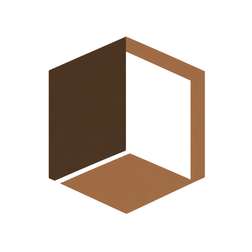
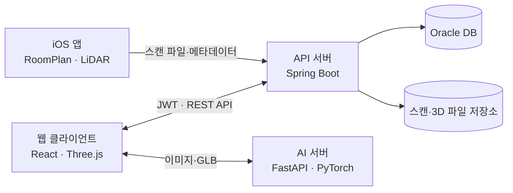
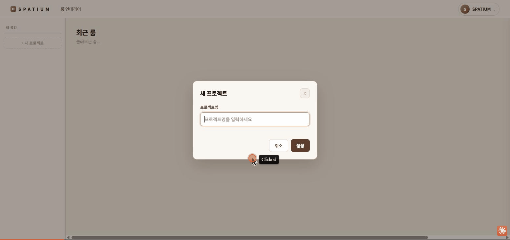
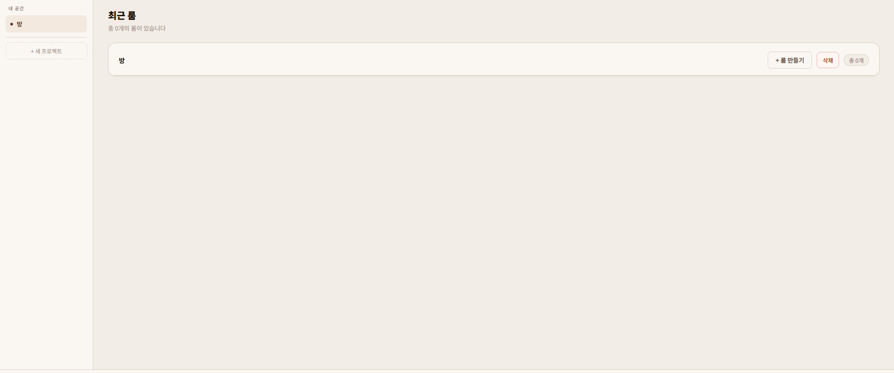
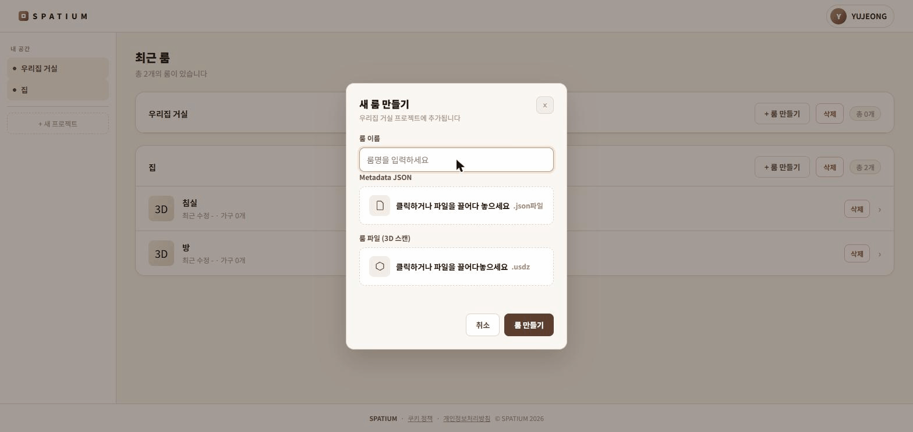
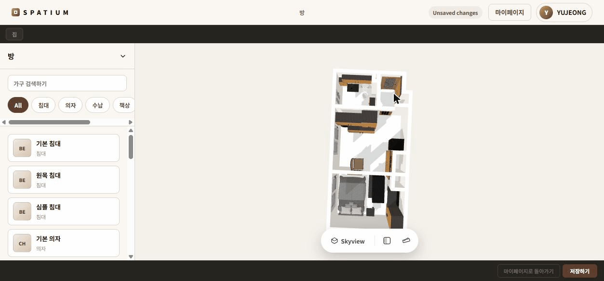

<a id="readme-top"></a>

<div align="center">
  

  <h1>Spatium</h1>

  <p>
    iPhone LiDAR로 현실의 방을 스캔하고,<br />
    웹에서 가구를 배치하거나 사진 속 사물을 3D 모델로 만드는 공간 편집 플랫폼
  </p>

  <p>
    <a href="https://github.com/dongha0312/Spatium/issues">버그 제보</a>
    ·
    <a href="https://github.com/dongha0312/Spatium/issues">기능 제안</a>
  </p>

  <p>
    
    
    
    
    
  </p>
</div>

<!-- TABLE OF CONTENTS -->
<details>
  <summary>목차</summary>
  <ol>
    <li><a href="#about-the-project">프로젝트 소개</a></li>
    <li><a href="#key-features">주요 기능</a></li>
    <li><a href="#architecture">시스템 구성</a></li>
    <li><a href="#built-with">기술 스택</a></li>
    <li>
      <a href="#getting-started">시작하기</a>
      <ul>
        <li><a href="#prerequisites">사전 요구 사항</a></li>
        <li><a href="#installation">설치 및 실행</a></li>
      </ul>
    </li>
    <li><a href="#usage">사용 흐름</a></li>
    <li><a href="#project-structure">프로젝트 구조</a></li>
    <li><a href="#license">라이선스</a></li>
  </ol>
</details>

## 프로젝트 소개 <a id="about-the-project"></a>

Spatium은 실제 공간을 디지털 3D 공간으로 옮겨 인테리어를 미리 구성해 볼 수 있는 서비스입니다. iOS 앱은 Apple RoomPlan과 LiDAR를 이용해 방의 구조를 수집하고, 웹 3D 에디터는 스캔한 공간에 가구를 배치·이동·회전하며 결과를 저장합니다.

원하는 가구 모델이 없을 때는 사진을 업로드해 배경을 분리하고 GLB 모델로 생성할 수 있습니다. 이렇게 만든 모델도 기존 가구와 동일하게 3D 공간에 배치할 수 있습니다.

### 해결하려는 문제

- 실제 치수를 반영하지 않은 인테리어 시안은 가구의 크기와 동선을 판단하기 어렵습니다.
- 원하는 가구의 3D 에셋을 직접 찾거나 제작하는 과정은 일반 사용자에게 부담이 큽니다.
- 스캔, 편집, 사용자 제작 모델 관리가 서로 다른 도구에 흩어지기 쉽습니다.

Spatium은 **공간 스캔 → 웹 편집 → Image-to-3D → 저장과 복원**을 하나의 흐름으로 연결합니다.

<p align="right">(<a href="#readme-top">맨 위로</a>)</p>

## 주요 기능 <a id="key-features"></a>

| 기능 | 설명 |
| --- | --- |
| LiDAR 공간 스캔 | iPhone에서 RoomPlan으로 방 구조를 스캔하고 USDZ 및 메타데이터를 업로드합니다. |
| 프로젝트·방 관리 | 사용자별 프로젝트와 여러 방을 생성하고 조회·수정·삭제합니다. |
| 3D 인테리어 편집 | Three.js 기반 에디터에서 가구를 배치하고 이동·회전·교체·삭제합니다. |
| 현실적인 배치 보조 | 벽·가구 충돌 제한, 문·창문 벽 두께 보정, 카메라 기준 벽 투명화를 지원합니다. |
| 편집 상태 저장 | 방과 가구의 편집 상태를 재생 가능한 메타데이터로 저장하고 다시 복원합니다. |
| 사진 기반 3D 생성 | YOLO 또는 GroundingDINO + SAM2로 사물을 분리하고 TripoSR 또는 Stable Fast 3D로 GLB를 생성합니다. |
| 사용자 인증 | 로컬 및 소셜 로그인, JWT 기반 세션, 프로필과 계정 관리를 제공합니다. |

<p align="right">(<a href="#readme-top">맨 위로</a>)</p>

## 시스템 구성 <a id="architecture"></a>



| 애플리케이션 | 역할 | 기본 포트 |
| --- | --- | ---: |
| `spatium-ios` | LiDAR 방 스캔, 프로젝트 조회, 모바일 3D 편집 | - |
| `spatium-frontend` | 웹 UI, 프로젝트 관리, 3D 공간 편집 | `3000` |
| `spatium-backend` | 인증, 프로젝트·방·가구 REST API, 파일 및 DB 관리 | `8080` |
| `spatium-img-to-3d` | 이미지 분할, 배경 제거, GLB 모델 생성 | `8000` |

<p align="right">(<a href="#readme-top">맨 위로</a>)</p>

## 기술 스택 <a id="built-with"></a>

### Web

- React 19, React Router 6
- Three.js
- Axios
- Create React App

### Backend

- Java 17, Spring Boot 4
- Spring Security, JWT
- Spring Data JPA, Oracle Database
- Gradle

### AI

- Python 3.11+, FastAPI, Uvicorn
- PyTorch, TripoSR, Stable Fast 3D
- YOLO, GroundingDINO, SAM2
- GLB, Trimesh

### iOS

- Swift, SwiftUI
- RoomPlan, RealityKit/SceneKit
- GLTFKit2
- iOS 17+

<p align="right">(<a href="#readme-top">맨 위로</a>)</p>

## 시작하기 <a id="getting-started"></a>

전체 기능을 로컬에서 사용하려면 프론트엔드, 백엔드, AI 서버를 각각 실행해야 합니다. iOS 앱은 macOS와 LiDAR 지원 기기가 필요합니다.

### 사전 요구 사항 <a id="prerequisites"></a>

- [Git](https://git-scm.com/)
- [Node.js](https://nodejs.org/) 및 npm
- JDK 17
- Oracle Database와 접속 가능한 스키마
- Python 3.11 이상 및 [uv](https://docs.astral.sh/uv/)
- AI 로컬 추론용 NVIDIA GPU/CUDA 환경(권장)
- iOS 앱 실행 시 macOS, Xcode, iOS 17 이상의 LiDAR 지원 iPhone/iPad

### 설치 및 실행 <a id="installation"></a>

#### 1. 저장소 복제

```bash
git clone https://github.com/dongha0312/Spatium.git
cd Spatium
```

#### 2. 백엔드

Spring Boot는 다음 설정을 환경에 맞게 요구합니다.

| 환경 변수 | 용도 |
| --- | --- |
| `SPRING_DATASOURCE_URL` | Oracle JDBC URL |
| `SPRING_DATASOURCE_USERNAME` | DB 사용자 이름 |
| `SPRING_DATASOURCE_PASSWORD` | DB 비밀번호 |
| `SPATIUM_JWT_SECRET` | JWT 서명 키 |
| `SPATIUM_OAUTH_GOOGLE_CLIENT_ID` | Google OAuth 클라이언트 ID(선택) |
| `SPATIUM_OAUTH_APPLE_CLIENT_ID` | Apple OAuth 클라이언트 ID(선택) |

PowerShell 예시:

```powershell
cd spatium-backend
$env:SPRING_DATASOURCE_URL="jdbc:oracle:thin:@//localhost:1521/FREEPDB1"
$env:SPRING_DATASOURCE_USERNAME="your_username"
$env:SPRING_DATASOURCE_PASSWORD="your_password"
$env:SPATIUM_JWT_SECRET="replace-with-a-long-random-secret"
./gradlew.bat bootRun
```

macOS/Linux에서는 `./gradlew bootRun`을 사용합니다. 필요한 스키마 변경 SQL은 `spatium-backend/src/main/resources/`의 `migration_*.sql` 파일을 확인하세요.

#### 3. 프론트엔드

```bash
cd spatium-frontend
npm ci
npm start
```

개발 서버는 [http://localhost:3000](http://localhost:3000)에서 열립니다. 백엔드 요청은 기본적으로 `http://localhost:8080`으로 전달됩니다. AI 서버를 로컬에서 실행한다면 `spatium-frontend/src/setupProxy.js`의 `imageTo3dTarget`을 `http://localhost:8000`으로 변경하세요.

Windows에서는 저장소 루트의 `sever_starter.bat`을 실행해 프론트엔드와 백엔드 터미널을 한 번에 열 수도 있습니다.

#### 4. Image-to-3D 서버

```powershell
cd spatium-img-to-3d
$env:UV_CACHE_DIR=".uv-cache"
uv sync
Copy-Item .env.example .env
uv run uvicorn app.main:app --reload --port 8000 --env-file .env
```

서버 UI는 [http://127.0.0.1:8000](http://127.0.0.1:8000), API 문서는 [http://127.0.0.1:8000/docs](http://127.0.0.1:8000/docs)에서 확인할 수 있습니다.

기본 로컬 TripoSR 모델과 선택 모델 설치 방법은 [`spatium-img-to-3d/README.md`](spatium-img-to-3d/README.md)를 참고하세요. 모델 가중치와 토큰은 Git에 커밋하지 마세요.

#### 5. iOS 앱

1. macOS에서 `spatium-ios/Spatium.xcodeproj`를 Xcode로 엽니다.
2. Swift Package 의존성 복원이 끝날 때까지 기다립니다.
3. `Spatium` 스킴과 개발 팀(Signing)을 설정합니다.
4. LiDAR 지원 실기기를 연결해 앱을 실행합니다.
5. 앱의 **설정 → 개발자 서버 설정**에서 백엔드, AI 서버, 가구 에셋 서버 주소를 실행 환경에 맞게 변경합니다.

실기기에서 PC의 로컬 서버에 접속할 때는 `localhost` 대신 같은 네트워크에 있는 PC의 IP 주소를 사용해야 합니다.

<p align="right">(<a href="#readme-top">맨 위로</a>)</p>

## 사용 흐름 <a id="usage"></a>

1. iOS 앱에서 로그인하고 새 프로젝트를 만듭니다.
2. LiDAR로 방을 스캔한 뒤 결과를 프로젝트에 저장합니다.
3. 웹에서 같은 계정으로 로그인하고 저장된 방을 엽니다.
4. 3D 에디터에서 가구를 배치하고 크기·위치·회전을 조정합니다.
5. 필요한 경우 사진을 업로드해 사물을 분리하고 3D 가구를 생성합니다.
6. 편집 결과를 저장하고 이후 다시 열어 이어서 수정합니다.

<table>
  <tr>
    <td align="center"></td>
    <td align="center"></td>
  </tr>
  <tr>
    <td align="center"><strong>1. 공간 준비</strong></td>
    <td align="center"><strong>2. 방 불러오기</strong></td>
  </tr>
  <tr>
    <td align="center"></td>
    <td align="center"></td>
  </tr>
  <tr>
    <td align="center"><strong>3. 가구 배치·편집</strong></td>
    <td align="center"><strong>4. 결과 저장</strong></td>
  </tr>
</table>

<p align="right">(<a href="#readme-top">맨 위로</a>)</p>

## 프로젝트 구조 <a id="project-structure"></a>

```text
Spatium/
├── spatium-ios/          # SwiftUI · RoomPlan iOS 앱
├── spatium-frontend/     # React · Three.js 웹 클라이언트
├── spatium-backend/      # Spring Boot REST API
├── spatium-img-to-3d/    # FastAPI 이미지→3D 추론 서버
├── PROJECT_OVERVIEW.md   # 전체 시스템 기술 문서
├── 3D_MODELING_LOGIC.md  # 3D 에디터 내부 로직
└── 3D_EDITOR_PRESENTATION.md
```

<p align="right">(<a href="#readme-top">맨 위로</a>)</p>

## 라이선스 <a id="license"></a>

Copyright © Spatium Team. All Rights Reserved.

이 프로젝트와 저장소에 포함된 소스 코드, 문서, 이미지, 3D 모델 및 기타 모든 자료의 저작권은 Spatium 팀에 있습니다.

Spatium 팀의 사전 서면 허가 없이는 누구도 이 프로젝트의 전부 또는 일부를 사용, 복제, 수정, 병합, 게시, 배포, 재라이선스, 판매하거나 상업적·비상업적 목적으로 이용할 수 없습니다. 저장소를 열람할 수 있다는 사실만으로 어떠한 사용 권한도 부여되지 않습니다.

<p align="right">(<a href="#readme-top">맨 위로</a>)</p>

## 프로젝트 링크

[https://github.com/dongha0312/Spatium](https://github.com/dongha0312/Spatium)

---

README 구성은 [Best README Template](https://github.com/othneildrew/Best-README-Template)을 참고했습니다.
