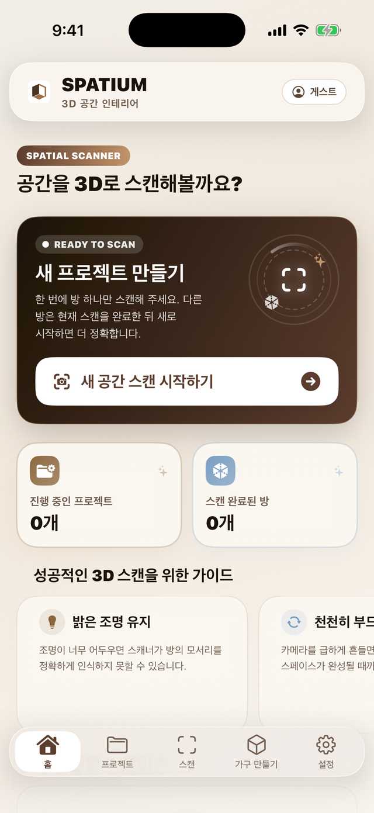
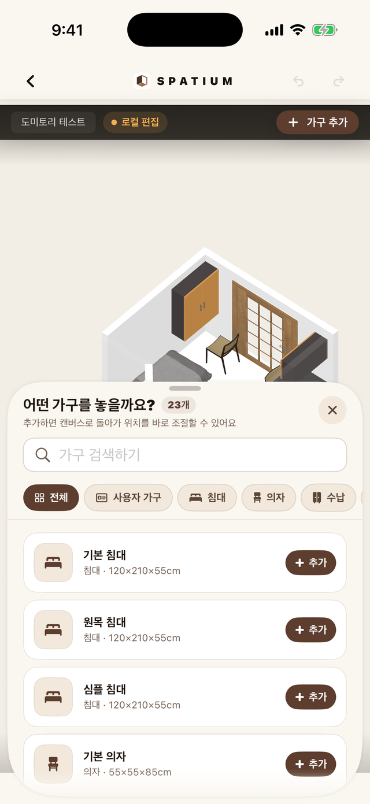
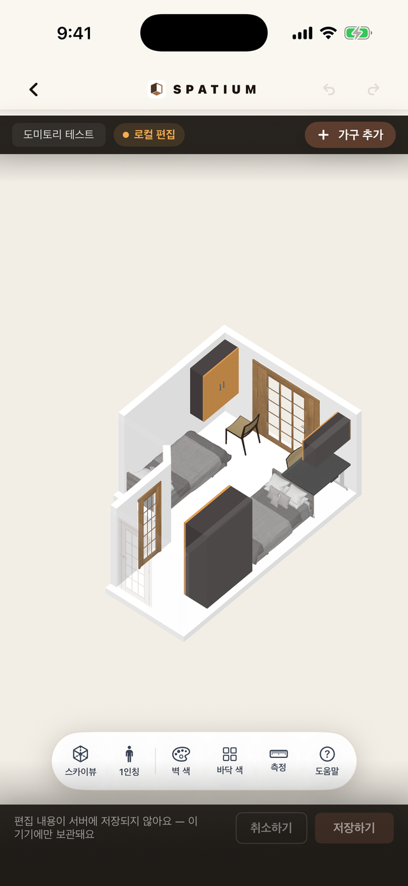
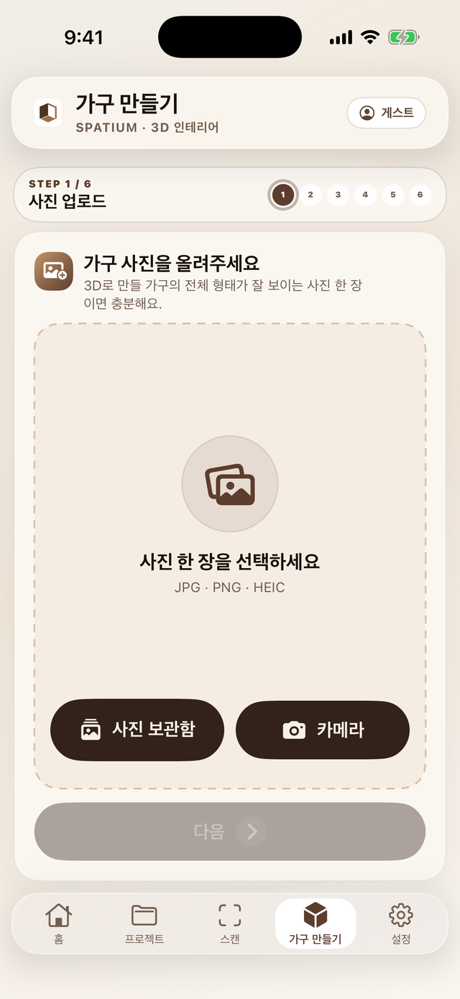

<div align="center">
  
  <h1>Spatium for iOS</h1>
  <p><strong>현실의 공간을 스캔하고, 원하는 인테리어를 3D로 미리 그려보세요.</strong></p>
  <p>
    
    
    
    
  </p>
</div>

Spatium은 LiDAR로 실제 방을 스캔해 3D 공간으로 만들고, 그 안에 가구를 배치·편집해 인테리어를 시뮬레이션하는 iOS 앱입니다. 기본 카탈로그는 물론, 사진 한 장으로 직접 생성한 3D 가구도 공간에 배치할 수 있습니다.

| | |
|---|---|
| **플랫폼** | iOS 17.0+ (iPhone / iPad) |
| **언어 / UI** | Swift 5.0 · SwiftUI |
| **3D** | SceneKit · [GLTFKit2](https://github.com/warrenm/GLTFKit2) 0.5.15 |
| **방 스캔** | Apple RoomPlan (LiDAR) |
| **번들 ID** | `name.dongharyu.Spatium` |
| **버전** | 1.0 (build 1) |

---

## 📸 미리보기

<p align="center">
  
  
  
  
</p>

---

## ✨ 주요 기능

- 📷 **방 스캔** — RoomPlan(LiDAR)으로 방을 스캔해 USDZ + 메타데이터로 저장
- 🪑 **3D 룸 에디터** — 가구 배치/이동/편집(벽 충돌 처리), undo·redo, 3D·스카이뷰·1인칭 시점, 치수 측정, 책장 꾸미기, 임시 저장·복구
- 🖼️ **사진 → 3D 가구 생성** — 6단계 위저드(업로드→이름→객체 분리→3D 생성→보정→저장)로 가구 사진을 3D 모델로 변환해 내 가구로 추가(로그인 필요)
- 📁 **프로젝트/룸 관리** — 프로젝트·룸 생성·이름 변경·삭제, 당겨서 새로고침
- 🔐 **인증** — 이메일 로그인 + Google·Apple 소셜 로그인 + 게스트 모드
- 👋 **온보딩** — 첫 실행 시 기능 소개
- 🔄 **가로모드·접근성** — 전 화면 가로모드(compact-height) 레이아웃, VoiceOver·큰 글씨 대응

---

## 📱 화면 구성

하단 5개 탭으로 구성됩니다.

| 탭 | 설명 |
|----|------|
| 홈 | 대시보드 — 프로젝트 요약, 빠른 진입 |
| 프로젝트 | 프로젝트/룸 목록 및 상세, 내 가구 |
| 스캔 | RoomPlan 캡처 → 리뷰 → 파일 공유 / 서버 업로드(로그인 필요) |
| 가구 만들기 | 사진 → 3D 가구 생성(로그인 필요) |
| 설정 | 프로필 편집, 로그아웃, 약관 |

첫 실행: **온보딩 → 로그인/게스트 게이트 → 메인 탭** 순으로 진입합니다.

### 게스트 모드 범위

| 사용 가능 | 로그인 필요 |
|-----------|-------------|
| 로컬 프로젝트·룸, RoomPlan 스캔, 스캔 파일 공유, 로컬 3D 편집·임시 저장, 기본 가구 카탈로그 | AI 배경 제거·3D 가구 생성, 스캔 서버 업로드, 서버 프로젝트 저장·동기화, 사용자 가구 동기화, 프로필·계정 기능 |

게스트가 인증 필요 기능에 진입하거나 업로드를 누르면 제한 이유를 안내하고 로그인 화면으로 연결합니다.

---

## 🚀 시작하기

### 요구 사항

- Xcode 16 이상
- iOS 17.0 이상 (방 스캔은 **LiDAR 탑재 기기** 필요)
- Swift Package는 Xcode가 자동으로 해결합니다 (GLTFKit2)

### 빌드 & 실행

```bash
git clone https://github.com/dongha0312/Spatium.git
cd Spatium/spatium-ios
open Spatium.xcodeproj
```

Xcode에서 **Spatium** 스킴을 선택하고 실기기/시뮬레이터로 실행합니다.

> ⚠️ RoomPlan 방 스캔은 시뮬레이터에서 동작하지 않습니다. LiDAR가 있는 실기기에서 테스트하세요.

명령줄 빌드:

```bash
xcodebuild \
  -project Spatium.xcodeproj \
  -scheme Spatium \
  -configuration Debug \
  -destination 'generic/platform=iOS Simulator' \
  build
```

---

## ⚙️ 서버 설정

앱이 직접 연결하는 주소는 2개입니다. (`Core/Networking/SpatiumAPIEnvironment.swift`)

| 용도 | 기본 주소 |
|------|-----------|
| Spring API 서버 | `http://210.119.12.115:8080` |
| 기본 가구 에셋 서버 | `http://210.119.12.115:3000` |

사진 배경 제거와 3D 생성은 인증된 Spring `/api/ai/*`로 요청합니다. Spring이 내부 인증으로 Image-to-3D 서버를 호출하고 PNG/GLB를 앱에 스트리밍하므로, 앱은 FastAPI 주소나 내부 키를 알지 못합니다. 사용자가 만든 가구 모델도 인증된 `/api/furniture/{id}/model`에서 받고, 공개 에셋 서버는 기본 카탈로그의 `/data` 모델에만 사용합니다. 따라서 JWT가 없는 게스트는 AI 생성과 사용자 가구 서버 동기화를 사용할 수 없습니다.

가구 사진은 선택 직후 메인 스레드 밖에서 ImageIO로 전처리합니다. 업로드용 긴 변은 최대 2048px·파일은 서버 계약과 같은 10MiB 이하로 제한하고, 화면에는 최대 1024px 미리보기만 유지합니다. 이미 제한 안에 있는 PNG/JPEG는 원본 바이트를 보존하며 HEIC 등 비호환 형식만 PNG로 변환합니다.

대용량 GLB는 전송·보정 중 `Data`로 통째로 만들지 않습니다. AI 생성 결과와 서버 가구 모델은 `URLSession` 임시 파일로 내려받아 최종 캐시·저장소로 이동하고, 유효성 확인도 파일의 `glTF` 헤더 4바이트만 읽습니다. 사용자 가구 업로드는 원본 파일을 1MiB 청크로 임시 multipart 바디에 복사한 뒤 파일 스트림으로 전송합니다. 보정 변환 저장도 메인 스레드 밖에서 GLB의 JSON 청크만 수정하고 큰 BIN 청크는 1MiB씩 새 파일로 복사해 모델 크기만큼의 중복 메모리 할당을 피하며, 완료 후 중간 보정 파일을 제거합니다.

사용자 가구 저장소의 `catalog.json` 초기 읽기·JSON 디코딩·레거시 단위 변환·최신순 정렬과 GLB 복사·교체·삭제 및 카탈로그 인코딩·쓰기는 utility 우선순위의 전용 직렬 큐에서 처리합니다. 앱 시작 직후 저장·삭제·서버 승격이 들어오면 초기 로드를 먼저 완료한 뒤 변경을 적용해 기존 카탈로그가 빈 목록으로 덮이지 않게 하며, 디스크 반영이 성공한 뒤에만 `@Published` 목록을 갱신합니다. 모델 교체 도중 카탈로그 쓰기가 실패하면 임시 파일을 지우고 기존 GLB를 복구합니다. 게스트에게 새 제한을 추가하지 않으며, AI 생성과 서버 동기화는 로그인 필요 상태를 유지하고 기기에 이미 저장된 사용자 가구는 그대로 보존합니다.

프로젝트·방 목록 캐시의 초기 읽기·JSON 디코딩과 atomic 파일 쓰기·로그아웃 삭제도 utility 우선순위의 전용 직렬 큐에서 처리합니다. 로그인 상태에서는 캐시를 먼저 불러온 뒤 서버 새로고침을 이어가며, 로드 중 로그아웃이나 새 저장이 발생하면 이전 파일 스냅샷을 적용하지 않습니다. 각 스냅샷에 증가하는 revision을 붙여 연속 변경 작업이 겹쳐도 오래된 저장이 최신 `projects.json`을 덮어쓰지 않으며, 프로젝트별 방 개수와 방별 항목 수를 병렬로 집계한 뒤에는 전체 캐시를 각각 한 번만 기록합니다. 로그인 화면의 게스트 프로젝트 유실 위험 계산도 백그라운드에서 실행하고 확인이 끝날 때까지만 로그인 동작을 보류합니다. 저장 실패 알림과 최신 메모리 상태 재시도, 게스트의 로컬 프로젝트·방 작성 및 로그인 전 경고 동작은 그대로 유지합니다.

서버 방을 다시 열 때 `/api/rooms/{roomId}/scene` 응답의 USDZ Base64 디코딩과 `RoomScenes` 캐시의 atomic 파일 쓰기는 utility 우선순위 전용 직렬 큐에서 실행합니다. 동일한 방을 동시에 열어도 파일 교체가 겹치지 않으며, 잘못된 Base64는 기존처럼 USDZ URL 없이 메타데이터 기반 편집 상태로 열립니다. 이 엔드포인트는 인증된 서버 방 전용이므로 게스트의 로컬 스캔·파일 공유·3D 편집에는 새 제한이 없습니다.

로컬·폴백 방의 `RoomScans` 캐시는 디렉터리 생성, 파일 존재 확인, 다운로드 임시 파일 설치, JSON 읽기·디코딩·편집 아이템 변환, 저장 후 캐시 삭제를 앱 전체 공용 utility 직렬 큐에서 처리합니다. 방 목록이 여러 JSON의 항목 수를 병렬로 집계하는 동안 같은 파일 다운로드가 겹치면 먼저 설치된 캐시를 재사용합니다. 파일 URL·인증 헤더·캐시 이름·오류 폴백 동작은 유지하며, 게스트가 사용하는 로컬 스캔 열기와 3D 편집에도 새 제한이 없습니다.

에디터 복구본은 650ms 대기 후 `RoomLayout` 스냅샷을 만들고, JSON 인코딩·초기 읽기·디코딩·atomic 쓰기·삭제를 앱 전체 공용 utility 직렬 큐에서 처리합니다. 모든 쓰기와 삭제에 증가하는 revision을 부여해 취소된 이전 저장이 나중에 도착하더라도 최신 복구본이나 사용자의 폐기 결과를 되돌리지 못하게 합니다. 저장된 상태와의 비교도 JSON 재인코딩 대신 `RoomLayout` 값 비교를 사용합니다. 게스트의 로컬 3D 편집·임시 저장·복구는 그대로 사용할 수 있으며 서버 저장만 기존과 동일하게 로그인이 필요합니다.

SceneKit 가구 모델 템플릿 캐시는 최근 사용 순서(LRU)로 최대 8개, 원본 GLB 크기 합계 64MiB를 기준으로 제한합니다. 가장 오래 사용하지 않은 템플릿부터 해제하고 메모리 경고 때는 전체를 비우며, 단일 모델이 예산보다 큰 경우에는 반복 파싱을 막기 위해 해당 모델 한 개만 유지합니다. 이미 방에 배치된 노드는 캐시 퇴거와 무관하게 그대로 표시됩니다.

인증 토큰은 앱 시작 시 Keychain에서 확인한 뒤 메모리에서 재사용해 API 요청마다 동기 조회하지 않으며, 갱신 토큰은 처음 필요할 때 한 번만 읽습니다. 토큰 저장은 기존 항목 삭제 후 재생성 대신 `update-or-add`로 처리합니다. 프로필의 base64 이미지 디코딩과 새 아바타의 512px JPEG 전처리, 설정 화면의 캐시 용량 계산·삭제도 메인 스레드 밖에서 실행합니다.

가구 만들기 진행 단계와 서버 작업 결과는 탭을 이동해도 유지하되, 탭이 숨겨지거나 앱이 백그라운드로 가면 화면용 디코딩 이미지와 보정 단계의 SceneKit 씬을 해제합니다. 다시 활성화하면 보관한 압축 이미지 데이터와 GLB URL에서 필요한 표시 리소스만 복원해, 진행 상태를 잃지 않으면서 숨은 탭의 메모리 점유를 줄입니다.

- **Debug** 빌드에서는 숨겨진 개발자 설정으로 서버 주소를 변경할 수 있습니다.
- **Release** 빌드에서는 배포 주소로 고정됩니다.
- 현재 서버가 IP + 평문 HTTP로 서비스되어 `Info.plist`에서 ATS(`NSAllowsArbitraryLoads`)를 허용해 둔 상태이며, 백엔드 HTTPS 전환 후 도메인 예외로 좁힐 예정입니다.

**소셜 로그인**은 `Core/Networking/SpatiumSocialConfig.swift`에서 Google OAuth 클라이언트 ID를 관리합니다.

---

## 🗂️ 프로젝트 구조

```
Spatium/
├─ SpatiumApp.swift        # @main 진입점
├─ App/                    # ContentView — 온보딩→로그인 게이트→탭
├─ Core/
│  ├─ DesignSystem/        # 테마, 약관 링크
│  ├─ Networking/          # API 클라이언트·환경·소셜 설정
│  ├─ Models/              # 도메인 모델 (Project, RoomLayout, Auth 등)
│  ├─ Extensions/          # JWT, Haptics, 유틸
│  └─ Services/            # Auth/Project/ImgTo3D/Furniture 스토어·서비스
├─ Features/               # 화면 단위 모듈
│  ├─ Auth/  Home/  Rooms/  Scan/  Settings/  Onboarding/
│  ├─ Editor/              # 3D 에디터 — 뷰모델(+History/Draft/Furniture/Decor 확장),
│  │                       #   씬 컨트롤러(카메라·제스처·노드·배치), 편집 UI 컴포넌트
│  └─ ImgTo3D/             # 사진→3D — 단계별 전용 뷰(입력/처리/보정/저장) + 위저드 크롬
├─ Shared/                 # 재사용 UIKit 브리지·컴포넌트
├─ PrivacyInfo.xcprivacy   # 개인정보 매니페스트
├─ Assets.xcassets/        # 아이콘·이미지·컬러
└─ testdata/               # 내장 3D 모델·테스트 스캔
```

`Core`(공용 인프라·도메인) / `Features`(화면) / `Shared`(재사용 UI) 3계층으로 분리하고, 상태는 `ObservableObject` 스토어(`ProjectStore`, `UserFurnitureStore`, `AuthTokenStore` 등)로 관리합니다.

---

## 🧪 테스트

- **SpatiumTests** — 유닛 테스트 75개 (Swift Testing): 백엔드 API 계약과 파일 기반 multipart 구성, 에디터 undo·redo와 복구본의 백그라운드 읽기·저장·삭제·revision 순서, SceneKit 증분 렌더링·모델 템플릿 LRU·뷰어 리소스 해제, 서버 룸 USDZ의 백그라운드 Base64 복원·손상 응답 처리, 로컬 스캔 JSON의 백그라운드 읽기·디코딩·항목 집계·캐시 삭제, 스캔 생명주기, GLB 보정 스트리밍·가구 치수·프로필 이미지 다운샘플링·변환, 사용자 가구의 백그라운드 초기 로드·초기화 경합·동시 저장·파일 롤백, 설정 캐시 작업 범위, 프로젝트 캐시의 백그라운드 초기 읽기·저장·최신 스냅샷 순서·실패 복구·게스트 위험 계산
- **SpatiumUITests** — UI 테스트 23개 + 런치 테스트 1개 (XCUITest): 게스트 기능 제한 안내, 에디터·꾸미기·카탈로그 회귀, 가로모드 레이아웃 스위트, 접근성 큰 글씨, 런치 성능

DEBUG 빌드는 로그인 없이 특정 화면·상태로 바로 진입하는 `-UITest…` 실행 인자를 20여 개 지원합니다(스크린샷·UI 테스트용). 대표적으로 `-UITestEditor`(3D 에디터 직행), `-UITestImgTo3D`, `-UITestGuestRestrictions`, `-UITestOnboarding`, `-UITestGuestCreate` 등 — 전체 목록은 `ContentView.swift`와 각 Feature 뷰에서 확인할 수 있습니다.

---

## 📚 문서

앱 전체 아키텍처·데이터 흐름·함정 노트는 [이번 앱 프로젝트 정리본.md](이번%20앱%20프로젝트%20정리본.md)에 상세히 정리돼 있습니다.

---

## 🔗 관련 저장소

이 디렉터리는 Spatium 모노레포의 iOS 앱입니다. 함께 구성되는 프로젝트:

- [`spatium-backend`](../spatium-backend) — API 서버
- [`spatium-frontend`](../spatium-frontend) — 웹 프론트엔드
- [`spatium-img-to-3d`](../spatium-img-to-3d) — 사진 → 3D 변환 서버
